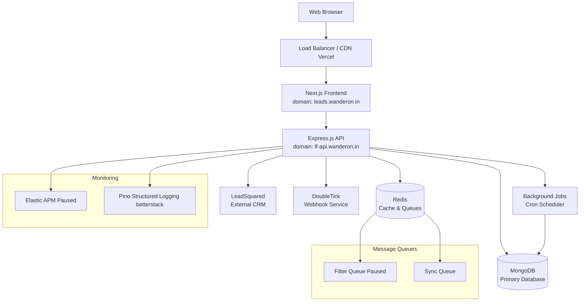

# System Architecture Overview

## 🏗️ High-Level Architecture



## 🔄 Data Flow Patterns

### ✅ 1. Lead Processing Flow (High-Level)

```text
Lead Capture → Validation → Salesperson Assignment (async) → Filter Assignment → Queue → CRM Sync → Follow-up
```

* **Lead Capture**: Incoming lead from website/form/integration.
* **Validation**: Initial deduplication, required fields, phone and destination check.
* **Salesperson Assignment**:

  * Done **before** pushing to CRM to reduce round-trips.
  * Coul be done asynchronously to reduce API response time and improve throughput.
* **Filter Assignment**: Based on destination, mapping rules, and percentage split.
* **Queue**: Pushed to Redis filter queue for async processing.
* **CRM Sync**: After filtering, the lead is pushed to CRM and enters the follow-up lifecycle.

---

### ✅ 2. Opportunity Management Flow

```text
Raw Opportunity → Sales Assignment  → Filtering → CRM PHASE → Status Tracking
```

* **Raw Opportunity**: Stored as-is on capture.
* **Sales Assignment**: Enhanced mapping based on destination, source platform, availability, and intelligent load balancing with fallback mechanisms.
* **Filtering**: Business rules applied to determine the lead's journey.
* **CRM Integration**: Opportunity is synced with the CRM (previously LeadSquared now in house).
* **Status Tracking**: Lifecycle tracked via stages like FRESH, FOLLOW-UP, WON, LOST.

---

### ✅ 3. Filter Assignment Logic (Core Detail)

When a lead enters the system:

1. The **destination** is analyzed.
2. Based on the **destination-to-filter map** and **filter percentage config**, the appropriate filter is assigned.
3. For PSV/WEST filters, **source-specific assignment** is performed:
   - Query available POCs for that destination
   - Filter POCs by source platform (if configured for that source)
   - Select POC with least lead count from available candidates
   - If no source-specific POCs available → fallback to any destination POC with least lead count
4. The lead is then **pushed into the Filter Queue** (`Redis Stream`).

The **Filter Queue Consumer**:

* Pulls each message.
* Checks the assigned filter.
* Takes appropriate action (e.g., push to CRM, trigger bot, wait for human confirmation).

---

### 🎯 Types of Filters (5 Total)

| Filter                             | Purpose                                                                                                       |
| ---------------------------------- | ------------------------------------------------------------------------------------------------------------- |
| **NO-FILTER**                      | Directly pushed to CRM for immediate action (used for high-quality or previously qualified destinations).     |
| **PSV** *(Pre-Sales Verification)* | Human verification with destination and source-based POC assignment. Supports load balancing across team members. |
| **WEST**                           | Automation filter with intelligent POC routing based on destination and source platform expertise.            |
| **UNKNOWN**                        | Destination could not be parsed or was missing (e.g., due to bot failure).                                    |
| **UPCOMING**                       | Lead was unsure about their travel destination/package during capture — follow-up required to confirm intent. |

---

### 🔄 Lead Lifecycle Post-Filter

```text
Lead → Filter [NO-FILTER | PSV | WEST | UNKNOWN | UPCOMING] → CRM Sync → CRM Stage:
   → FRESH
   → FOLLOW-UP
   → WON
   → LOST
```

---


## 🗂️ Component Architecture

### Backend (Node.js/Express)
- **Entry Point**: `server/index.ts`
- **Architecture Pattern**: Clean Architecture
  - **Routes**: HTTP endpoint definitions
  - **Controllers**: Request/response handling
  - **Use Cases**: Business logic orchestration
  - **Services**: Infrastrucureal services like Double Tick, Booking service etc.
  - **Repositories**: Data access layer
  - **Entities**: Domain models

### Frontend (Next.js)
- **Architecture Pattern**: Feature-based organization
- **State Management**: Redux Toolkit with Redux Persist
- **UI Framework**: Material-UI v6
- **Routing**: Next.js App Router (v14+)

## 🔧 Infrastructure Components

### Database Layer
- **Primary**: MongoDB 6.0+ with Mongoose ODM
- **Features**: 
  - Change Data Capture (CDC)
  - Indexed collections for performance
  - Document-based schema design

### Caching & Queuing
- **Redis 7.0+**: 
  - Session storage (not implemented yes)
  - Application caching 
  - Message queues (Redis Streams)
  - Rate limiting (to be implemented currently using in-memory implementations due to time constraints)

### Background Processing
- **Cron Jobs**: Node-cron for scheduled tasks
- **Message Consumers**: Redis Stream consumers (filter and sync queue)
- **Job Types**:
  - Lead score updates
  - Data synchronization
  - Automated notifications (to be implemented ion coming phases)

## 🌐 External Integrations

### LeadSquared CRM (To be removed since we moved to In-House CRM)
- **Purpose**: External CRM integration
- **Method**: REST API calls with rate limiting
- **Features**: Lead export, opportunity sync, activity tracking

### DoubleTick Webhooks
- **Purpose**: Status updates and notifications
- **Method**: Webhook endpoints
- **Use Cases**: PSV assignments, status changes

## 📊 Scalability Design

### Horizontal Scaling Ready
- **Stateless API**: Session stored in Redis
- **Queue-based Processing**: Async task handling
- **Database Sharding**: MongoDB native sharding support

### Performance Optimizations 
- **Connection Pooling**: MongoDB connection pooling
  
### Performance Optimizations To be implemented
- **Redis Caching**: Frequently accessed data
- **Background Processing**: Non-blocking operations

## 🔒 Security Architecture

### Authentication & Authorization
- **JWT Tokens**: Stateless authentication
- **Session Management**: Mongo-based sessions

### Data Protection
- **Input Validation**: Zod schema validation
- **SQL Injection Prevention**: ODM-based queries
- **Rate Limiting**: Redis-based request limiting

## 📈 Observability

### Monitoring Stack
- **APM**: Elastic OpenTelemetry integration (implemented but need to be revived)
- **Metrics**: to be implemented in platfroms like elastic search or better stack
- **Logging**: Structured logging with Pino on better stack
- **Health Checks**: Built-in health endpoints

### Performance Tracking (to be implemented)
- **Event Loop Lag**: Monitoring Node.js performance
- **Database Queries**: MongoDB query performance
- **Redis Operations**: Cache hit/miss ratios

## 🔄 Development Workflow

### Environment Setup
- **Nix Flakes**: Reproducible development environment
- **Docker Compose**: Local service orchestration
- **Hot Reload**: Nodemon for backend, Next.js for frontend

### Testing Strategy (needs to be more extended)
- **Unit Tests**: Jest with TypeScript
- **Integration Tests**: Database and API testing
- **Coverage**: Code coverage reporting

## 📋 Configuration Management

### Environment Variables
- **Database**: `MONGO_URI`, `MONGO_DB_NAME`
- **Cache**: `REDIS_URI`
- **Auth**: `JWT_SECRET`, `COOKIE_SECRET`
- **Features**: `START_CDC`, `RUN_QUEUE_CONSUMERS`
- **External APIs**: LeadSquared, DoubleTick credentials

## 🚀 Deployment Architecture

### Current Setup
- **Frontend**: Next.js application
- **Backend**: Node.js Express server
- **Database**: MongoDB (managed digital ocean)
- **Cache**: Redis instance
- **Reverse Proxy**: Load balancer/CDN

### Container Support
- **Docker**: Full containerization support
- **Docker Compose**: Local development stack
- **Production Ready**: Environment-specific configurations
