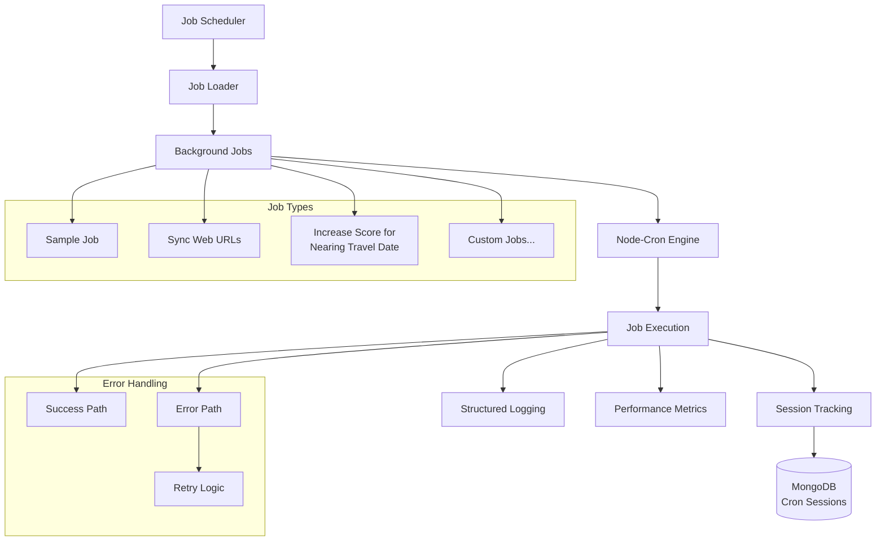

# Background Jobs & Scheduled Tasks

## 📋 Overview
The Lead Processor system uses a cron-based scheduler for background jobs and scheduled tasks. Built on top of `node-cron`, the system provides automated job execution, session tracking, error handling, and monitoring capabilities.

## 🏗️ Job Architecture



## 🔧 Scheduler Implementation

### Job Interface
```typescript
interface IJob {
  name: string;          // Human-readable job name
  schedule: string;      // Cron expression
  run(logger: IBaseLogger): Promise<void>;  // Job execution function
}
```

### Scheduler Core
```typescript
// server/background-scripts/scheduler.ts
interface ISchedulerDependencies {
  sessionRepo: ICronSessionRepo;
  logger: IBaseLogger;
}

export function initScheduler({ sessionRepo, logger }: ISchedulerDependencies) {
  const jobsDir = __dirname; // background-scripts folder

  fs.readdir(jobsDir, (err, files) => {
    if (err) {
      logger.error('Error reading jobs folder: ' + err);
      process.exit(1);
    }
    
    files.forEach(file => {
      // Skip the scheduler file itself
      if (file === 'scheduler.ts' || file === 'scheduler.js') return;

      try {
        const jobPath = path.join(jobsDir, file);
        const jobModule = require(jobPath);
        const job = jobModule.default || jobModule;
        
        if (job && job.schedule && job.run && job.name) {
          logger.info(`Scheduling job: ${job.name}`);
          
          cron.schedule(job.schedule, async () => {
            const session = await sessionRepo.createSession({ 
              jobName: job.name, 
              startTime: new Date() 
            });
            
            try {
              await job.run(logger);
              await sessionRepo.endSession(session.id, { 
                endTime: new Date() 
              });
            } catch (error: any) {
              await sessionRepo.endSession(session.id, { 
                endTime: new Date(), 
                error: error.message 
              });
            }
          });
        }
      } catch (error) {
        logger.error(`Failed to load job file ${file}: ${error}`);
      }
    });
  });
  
  // Keep process alive
  setInterval(() => { }, 1000);
}
```

## 📋 Job Types & Examples

### 1. Sample Job (Template)
```typescript
// server/background-scripts/sampleJob.ts
import { IBaseLogger } from '../interfaces/baseLogger.interface';
import { IJob } from './job.interface';

export const sampleJob: IJob = {
  name: 'Sample Job',
  schedule: '0 */4 * * *',  // Run every 4 hours
  run: async (logger: IBaseLogger): Promise<void> => {
    logger.info('Sample Job is running.');
    
    // Simulate async work
    await new Promise(resolve => setTimeout(resolve, 1000));
    
    logger.info('Sample Job completed.');
  }
};

export default sampleJob;
```

### 2. Web URL Synchronization Job
```typescript
// server/background-scripts/syncWebUrl.job.ts
import { createDestinationUseCase } from '../services/useCases/destination.usecase';
import { IBaseLogger } from '../interfaces/baseLogger.interface';
import { IJob } from './job.interface';
import { destinationRepo } from '../entities/destination/destination.repo';
import { webUrlsRepo } from '../entities/webUrls/webUrls.repo';
import { walrusService } from '../services/walrus.service';

export const syncWebUrlsJob: IJob = {
  name: 'Sync Web URLs Job',
  schedule: '0 9 * * *',  // Run at 9 AM daily
  run: async (logger: IBaseLogger): Promise<void> => {
    const destinationUseCase = createDestinationUseCase({ 
      logger, 
      destinationRepo, 
      webUrlsRepo, 
      walrusService 
    });
    
    logger.info('Sync Web URLs Job is running.');
    
    try {
      await destinationUseCase.syncWebUrls();
      logger.info('Web URLs synchronized successfully');
    } catch (error) {
      logger.error('Web URL sync failed:', error);
      throw error; // Re-throw to mark job as failed
    }
    
    logger.info('Sync Web URLs Job completed.');
  }
};

export default syncWebUrlsJob;
```

### 3. Opportunity Score Update Job
```typescript
// server/background-scripts/increaseScoreForNearingTravelDate.job.ts
import { IBaseLogger } from '../interfaces/baseLogger.interface';
import { IJob } from './job.interface';
import { rawOpportunityRepo } from '../entities/rawOpportunity/rawOpportunity.repo';

export const increaseScoreJob: IJob = {
  name: 'Increase Score for Nearing Travel Date',
  schedule: '0 2 * * *',  // Run at 2 AM daily
  run: async (logger: IBaseLogger): Promise<void> => {
    logger.info('Starting opportunity score update for nearing travel dates');
    
    const today = new Date();
    const thirtyDaysFromNow = new Date(today.getTime() + (30 * 24 * 60 * 60 * 1000));
    
    try {
      // Find opportunities with travel dates within 30 days
      const opportunities = await rawOpportunityRepo.find({
        travelDate: {
          $gte: today,
          $lte: thirtyDaysFromNow
        },
        stage: { $nin: ['CONVERTED', 'JUNK', 'NOT_INTERESTED'] },
        deleted: false
      });
      
      let updatedCount = 0;
      
      for (const opportunity of opportunities) {
        const daysUntilTravel = Math.floor(
          (opportunity.travelDate.getTime() - today.getTime()) / (24 * 60 * 60 * 1000)
        );
        
        // Increase score based on urgency
        let scoreIncrease = 0;
        if (daysUntilTravel <= 7) scoreIncrease = 20;
        else if (daysUntilTravel <= 14) scoreIncrease = 15;
        else if (daysUntilTravel <= 30) scoreIncrease = 10;
        
        if (scoreIncrease > 0) {
          await rawOpportunityRepo.updateById(opportunity._id, {
            opportunityScore: (opportunity.opportunityScore || 0) + scoreIncrease
          });
          updatedCount++;
        }
      }
      
      logger.info(`Updated opportunity scores for ${updatedCount} records`);
      
    } catch (error) {
      logger.error('Failed to update opportunity scores:', error);
      throw error;
    }
  }
};

export default increaseScoreJob;
```

## 📊 Session Tracking

### Cron Session Schema
```typescript
interface ICronSession {
  _id: ObjectId;
  jobName: string;
  startTime: Date;
  endTime?: Date;
  status: 'RUNNING' | 'COMPLETED' | 'FAILED';
  error?: string;
  metadata?: any;
  duration?: number;  // Calculated field in milliseconds
}
```

### Session Repository
```typescript
// server/entities/cronSession/cronSession.repo.ts
export const cronSessionRepo: ICronSessionRepo = {
  createSession: async ({ jobName, startTime }): Promise<ICronSessionSchema> => {
    const session = await CronSessionModel.create({ 
      jobName, 
      startTime,
      status: 'RUNNING'
    });
    console.log(`Session started for job "${jobName}" with id ${session._id}`);
    return session;
  },
  
  endSession: async (id: string, sessionData: Partial<ICronSessionSchema>): Promise<void> => {
    const updateData = {
      ...sessionData,
      status: sessionData.error ? 'FAILED' : 'COMPLETED'
    };
    
    if (sessionData.endTime && updateData.startTime) {
      updateData.duration = sessionData.endTime.getTime() - updateData.startTime.getTime();
    }
    
    const session = await CronSessionModel.findByIdAndUpdate(
      id.toString(), 
      updateData, 
      { new: true }
    );
    
    if (session) {
      if (sessionData.error) {
        console.error(`Session ${id} ended with error: ${sessionData.error}`);
      } else {
        console.log(`Session ${id} completed successfully.`);
      }
    }
  },
  
  getSessions: async (): Promise<ICronSessionSchema[]> => {
    return await CronSessionModel.find().sort({ startTime: -1 }).limit(100).exec();
  },
  
  getSessionsByJob: async (jobName: string, limit: number = 50): Promise<ICronSessionSchema[]> => {
    return await CronSessionModel.find({ jobName })
      .sort({ startTime: -1 })
      .limit(limit)
      .exec();
  },
  
  getRunningJobs: async (): Promise<ICronSessionSchema[]> => {
    return await CronSessionModel.find({ status: 'RUNNING' }).exec();
  }
};
```

## 🕐 Cron Schedule Patterns

### Common Patterns
```typescript
// Cron expression format: "second minute hour day month dayOfWeek"
// Note: node-cron uses 6-field format (includes seconds)

const schedulePatterns = {
  // Every minute
  everyMinute: '0 * * * * *',
  
  // Every 5 minutes
  every5Minutes: '0 */5 * * * *',
  
  // Every hour at minute 0
  hourly: '0 0 * * * *',
  
  // Every 4 hours
  every4Hours: '0 0 */4 * * *',
  
  // Daily at 2 AM
  dailyAt2AM: '0 0 2 * * *',
  
  // Daily at 9 AM
  dailyAt9AM: '0 0 9 * * *',
  
  // Weekly on Sunday at midnight
  weeklyMidnight: '0 0 0 * * 0',
  
  // Monthly on 1st at midnight
  monthlyFirst: '0 0 0 1 * *',
  
  // Weekdays at 6 PM
  weekdaysAt6PM: '0 0 18 * * 1-5',
  
  // Every 30 seconds (for testing)
  every30Seconds: '*/30 * * * * *'
};
```

### Job Schedule Examples
```typescript
const jobSchedules = {
  // Data synchronization jobs
  syncWebUrls: '0 0 9 * * *',          // Daily at 9 AM
  syncLeadSquared: '0 */15 * * * *',    // Every 15 minutes
  
  // Maintenance jobs
  cleanupSessions: '0 0 1 * * *',       // Daily at 1 AM
  optimizeDatabase: '0 0 3 * * 0',      // Weekly on Sunday at 3 AM
  
  // Business logic jobs
  updateOpportunityScores: '0 0 2 * * *',  // Daily at 2 AM
  sendDailyReports: '0 0 8 * * 1-5',       // Weekdays at 8 AM
  processFollowUps: '0 0 */2 * * *',       // Every 2 hours
  
  // Monitoring jobs
  healthCheck: '0 */5 * * * *',         // Every 5 minutes
  metricsCollection: '0 0 * * * *'      // Every hour
};
```

## 🔧 Error Handling & Monitoring

### Error Handling Pattern
```typescript
const robustJobTemplate: IJob = {
  name: 'Robust Job Template',
  schedule: '0 0 * * * *',
  run: async (logger: IBaseLogger): Promise<void> => {
    const jobName = 'Robust Job Template';
    logger.info(`Starting ${jobName}`);
    
    try {
      // Pre-execution checks
      await performHealthChecks();
      
      // Main job logic with timeout
      await Promise.race([
        executeMainLogic(),
        new Promise((_, reject) => 
          setTimeout(() => reject(new Error('Job timeout')), 30000)
        )
      ]);
      
      // Post-execution cleanup
      await performCleanup();
      
      logger.info(`${jobName} completed successfully`);
      
    } catch (error) {
      logger.error(`${jobName} failed:`, error);
      
      // Send alerts for critical jobs
      await sendErrorAlert(jobName, error);
      
      // Re-throw to mark job as failed
      throw error;
    }
  }
};

const performHealthChecks = async (): Promise<void> => {
  // Check database connectivity
  // Check external service availability
  // Validate configuration
};

const executeMainLogic = async (): Promise<void> => {
  // Actual job implementation
};

const performCleanup = async (): Promise<void> => {
  // Cleanup temporary resources
  // Close connections if needed
};

const sendErrorAlert = async (jobName: string, error: Error): Promise<void> => {
  // Send notification to monitoring system
  // Send email to administrators
  // Log to external monitoring service
};
```

### Job Monitoring
```typescript
// Job performance monitoring
const monitorJobPerformance = (jobName: string, duration: number, success: boolean) => {
  // Prometheus metrics
  jobExecutionTime.labels({ job_name: jobName }).observe(duration);
  jobExecutionCount.labels({ job_name: jobName, status: success ? 'success' : 'failure' }).inc();
  
  // Log structured data
  logger.info('Job execution completed', {
    jobName,
    duration,
    success,
    timestamp: new Date().toISOString()
  });
};

// Health check endpoint
app.get('/health/jobs', async (req, res) => {
  const runningJobs = await cronSessionRepo.getRunningJobs();
  const recentFailures = await CronSessionModel.find({
    status: 'FAILED',
    startTime: { $gte: new Date(Date.now() - 24 * 60 * 60 * 1000) }
  }).exec();
  
  res.json({
    runningJobs: runningJobs.length,
    recentFailures: recentFailures.length,
    status: recentFailures.length > 5 ? 'degraded' : 'healthy'
  });
});
```

## 🚀 Job Management & Operations

### Manual Job Execution
```typescript
// Manual job trigger endpoint (admin only)
app.post('/admin/jobs/:jobName/trigger', authGuard, async (req, res) => {
  const { jobName } = req.params;
  
  try {
    const job = getJobByName(jobName);
    if (!job) {
      return res.status(404).json({ error: 'Job not found' });
    }
    
    // Create session for manual execution
    const session = await cronSessionRepo.createSession({
      jobName: `${jobName} (manual)`,
      startTime: new Date()
    });
    
    // Execute job asynchronously
    job.run(logger)
      .then(() => cronSessionRepo.endSession(session.id, { endTime: new Date() }))
      .catch(error => cronSessionRepo.endSession(session.id, { 
        endTime: new Date(), 
        error: error.message 
      }));
    
    res.json({ message: 'Job triggered successfully', sessionId: session.id });
    
  } catch (error) {
    res.status(500).json({ error: error.message });
  }
});
```

### Job Configuration
```typescript
// Dynamic job configuration
interface JobConfig {
  enabled: boolean;
  schedule: string;
  timeout: number;
  retryCount: number;
  alertOnFailure: boolean;
}

const jobConfigs = new Map<string, JobConfig>([
  ['syncWebUrls', {
    enabled: true,
    schedule: '0 0 9 * * *',
    timeout: 300000, // 5 minutes
    retryCount: 3,
    alertOnFailure: true
  }],
  ['updateOpportunityScores', {
    enabled: true,
    schedule: '0 0 2 * * *',
    timeout: 600000, // 10 minutes
    retryCount: 2,
    alertOnFailure: true
  }]
]);
```

### Environment-Specific Jobs
```typescript
// Environment-aware job loading
const loadJobsForEnvironment = (environment: string) => {
  const jobs = [];
  
  // Always load core jobs
  jobs.push(syncWebUrlsJob);
  
  // Development-specific jobs
  if (environment === 'development') {
    jobs.push(testDataGeneratorJob);
    jobs.push(debugMetricsJob);
  }
  
  // Production-specific jobs
  if (environment === 'production') {
    jobs.push(dailyReportJob);
    jobs.push(backupJob);
    jobs.push(cleanupJob);
  }
  
  // Staging-specific jobs
  if (environment === 'staging') {
    jobs.push(dataSyncJob);
    jobs.push(performanceTestJob);
  }
  
  return jobs;
};
```

## 📊 Performance Considerations

### Resource Management
```typescript
// Resource-aware job execution
const executeWithResourceLimits = async (job: IJob, logger: IBaseLogger) => {
  const startMemory = process.memoryUsage();
  const startTime = Date.now();
  
  try {
    await job.run(logger);
    
    const endMemory = process.memoryUsage();
    const duration = Date.now() - startTime;
    
    // Log resource usage
    logger.info('Job resource usage', {
      jobName: job.name,
      duration,
      memoryUsed: endMemory.heapUsed - startMemory.heapUsed,
      peakMemory: endMemory.heapUsed
    });
    
  } catch (error) {
    logger.error('Job failed', { jobName: job.name, error: error.message });
    throw error;
  }
};
```

### Concurrent Job Management
```typescript
// Prevent overlapping job executions
const jobLocks = new Map<string, boolean>();

const executeWithLock = async (job: IJob, logger: IBaseLogger) => {
  if (jobLocks.get(job.name)) {
    logger.warn(`Job ${job.name} is already running, skipping execution`);
    return;
  }
  
  try {
    jobLocks.set(job.name, true);
    await job.run(logger);
  } finally {
    jobLocks.delete(job.name);
  }
};
```

## 🔒 Security & Best Practices

### Secure Job Execution
- **Principle of Least Privilege**: Jobs run with minimal required permissions
- **Input Validation**: Validate any external data used in jobs
- **Secrets Management**: Use environment variables for sensitive configuration
- **Audit Logging**: Track all job executions and their outcomes
- **Resource Limits**: Implement timeouts and memory limits

### Production Guidelines
- **Graceful Shutdown**: Handle SIGTERM/SIGINT to complete running jobs
- **Health Monitoring**: Regular health checks and alerting
- **Backup Strategy**: Ensure job state can be recovered
- **Rolling Updates**: Zero-downtime deployment considerations
- **Error Recovery**: Implement retry logic and fallback mechanisms
