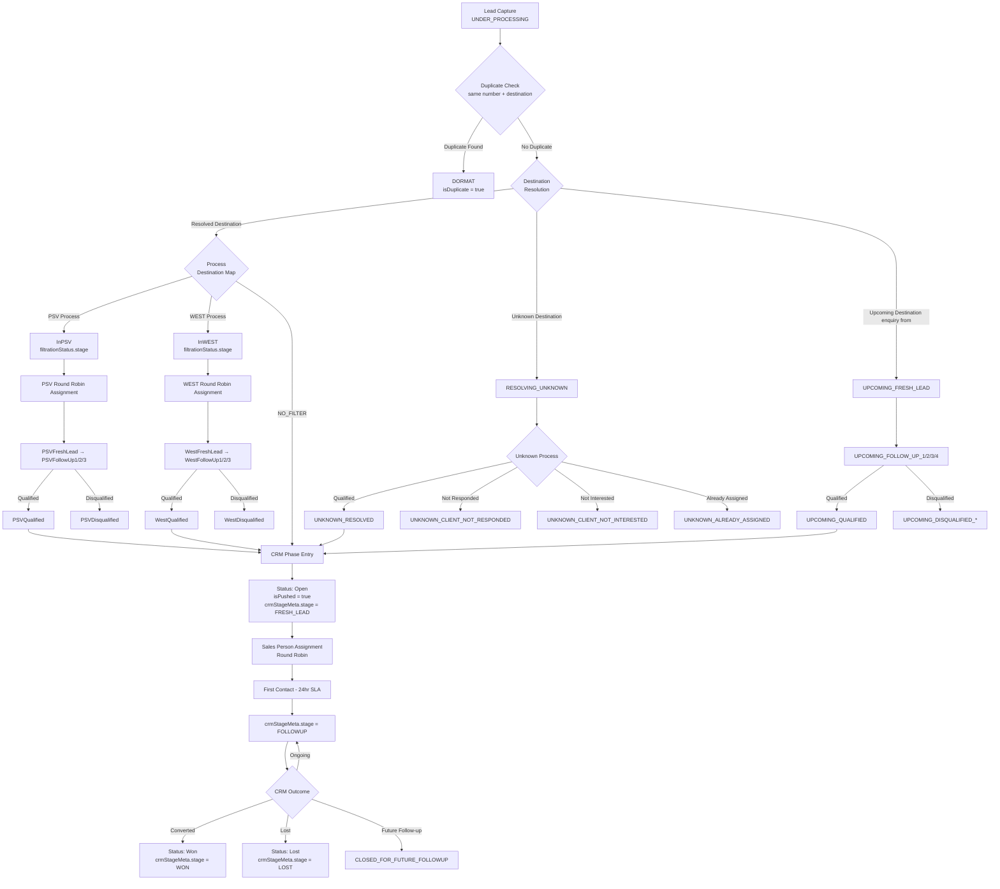
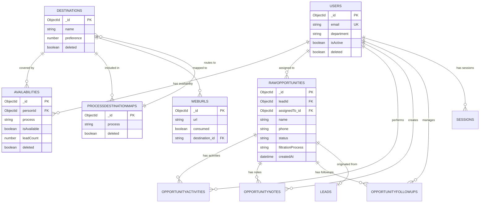
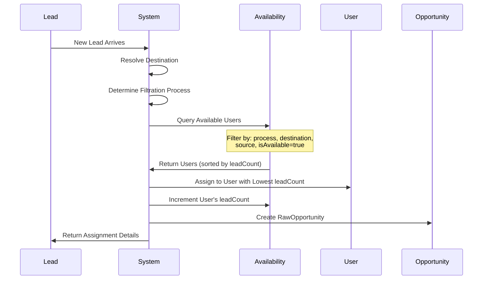
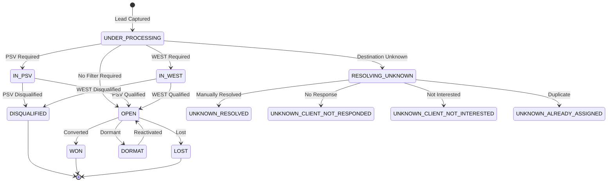
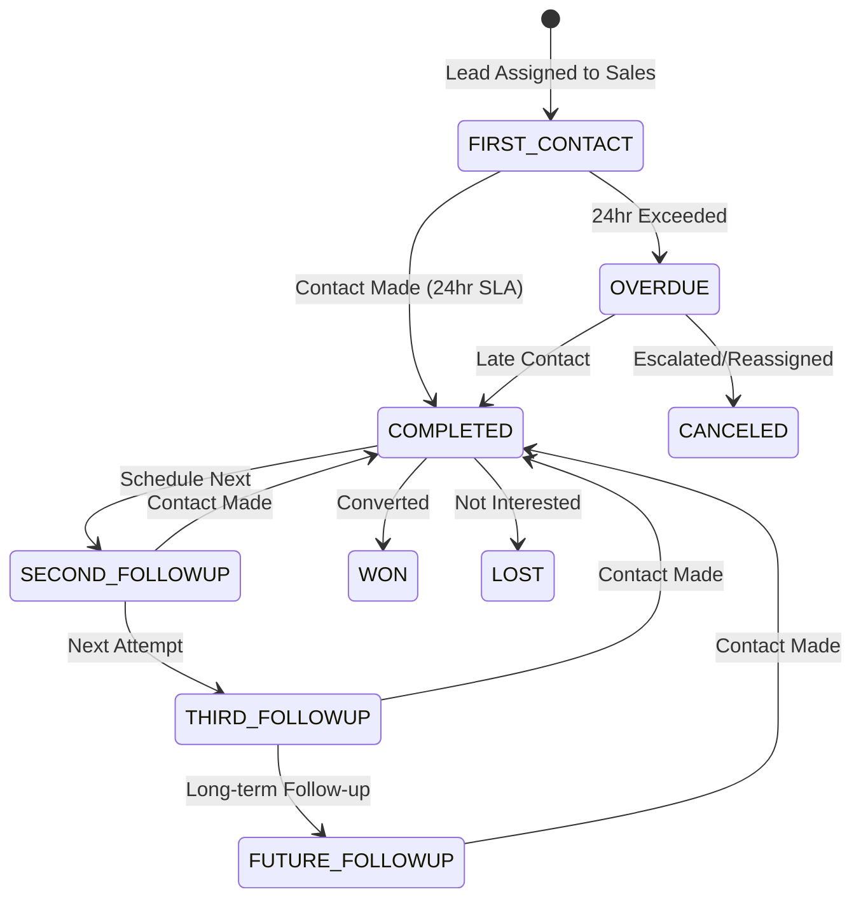

# Database Schema Documentation

## 📊 Overview
The Lead Processor system uses MongoDB as the primary database with Mongoose ODM for schema management. The database follows a document-based design optimized for lead management workflows with multi-stage filtration, round-robin assignment, and comprehensive activity tracking.

> **Note**: This documentation has been updated to accurately reflect the actual `IRawOpportunity` interface implementation and correct lead processing workflow phases. Key corrections include proper status enum values, filtration vs CRM phase distinctions, and field relationship clarifications.

## 🏗️ System Architecture Overview

The Lead Processor follows a sophisticated lead management workflow:

1. **Lead Capture**: Leads enter the system from various sources (website, paid ads, Instagram, WhatsApp, etc.)
2. **Destination Resolution**: System attempts to identify destination from URL, slugs, or manual marking
3. **Filtration Process**: Based on destination configuration, leads are routed through PSV or WEST filtration
4. **Round-Robin Assignment**: Sales persons and PSV agents are assigned leads in round-robin fashion
5. **Lead Processing**: PSV qualifies leads, Sales persons handle CRM activities
6. **Activity Tracking**: All interactions, status changes, and follow-ups are tracked

## 🗂️ Database Architecture

### Connection Configuration
```typescript
// Connection settings
{
  maxPoolSize: 5,
  useUnifiedTopology: true
}
```

### Collections Overview
| Collection | Purpose | Estimated Size | Growth Rate | Key Features |
|------------|---------|----------------|-------------|--------------|
| `users` | User management (PSV, Sales, Admin) | 100-500 docs | Low | Role-based access |
| `availabilities` | Round-robin assignment tracking | 200-1000 docs | Medium | Lead count & distribution |
| `destinations` | Travel destinations master data | 50-200 docs | Low | Filtration process mapping |
| `processdestinationmaps` | Filtration process configuration | 10-50 docs | Low | Load balancing & routing |
| `weburls` | CMS-synced URL to destination mapping | 1K-10K docs | Medium | Auto-destination detection |
| `rawopportunities` | Main lead/opportunity entity | 10K-1M docs | High | Complete lead lifecycle |
| `leads` | Lead source and metadata tracking | 10K-1M docs | High | Source attribution |
| `opportunityactivities` | Activity/audit trail | 50K-5M docs | High | Multi-phase tracking |
| `opportunitynotes` | User-generated notes | 5K-500K docs | Medium | Additional context |
| `opportunityfollowups` | Follow-up scheduling & tracking | 5K-500K docs | Medium | CRM workflow |
| `opportunityscoreconfiguration` | Scoring algorithm configuration | 5-20 docs | Low | Dynamic scoring |
| `sessions` | User session management | 100-1000 docs | Medium | Authentication |

## 👥 User Management Schema

### Users Collection
```typescript
interface IUser {
  _id: ObjectId;
  email: string;              // Unique index
  firstName?: string;
  lastName?: string;
  credentials: string;        // Bcrypt hashed password
  phone?: {
    countryCode: string;
    number: string;
  };
  department: UserDepartment; // SALES | PSV | WEST | ADMIN
  isActive: boolean;
  deleted: boolean;
  createdBy?: ObjectId;       // References users._id
  modifiedBy?: ObjectId;      // References users._id
  updatedAt: Date;
}

enum UserDepartment {
  SALES = "SALES",     // Sales persons handle qualified leads
  PSV = "PSV",         // Pre-sales verification agents
  WEST = "WEST",       // Western market specialists  
  ADMIN = "ADMIN"      // System administrators
}
```

**Key Features:**
- **PSV Users**: Handle lead qualification and initial screening
- **Sales Users**: Manage qualified opportunities in CRM phase
- **WEST Users**: Specialized for western market destinations
- **Admin Users**: System configuration and user management

**Indexes:**
```javascript
{ email: 1, deleted: 1 }     // Unique email lookup
{ department: 1, isActive: 1 }  // Role-based queries
{ isActive: 1, deleted: 1 }     // Active user queries
```

### Sessions Collection
```typescript
interface ISession {
  _id: ObjectId;
  userId?: ObjectId;          // References users._id
  token: string;              // JWT token hash
  expiry: Date;
  isActive: boolean;
  createdAt: Date;
}
```

**Indexes:**
```javascript
{ token: 1, expiry: 1 }      // Login lookup
{ userId: 1, isActive: 1 }   // User session cleanup
{ expiry: 1 }                // TTL index for auto-cleanup
```

## 🎯 Availability & Assignment Schema

### Availabilities Collection
**Purpose**: Controls round-robin lead assignment for PSV and Sales persons

```typescript
interface IAvailability {
  _id: ObjectId;
  personId: ObjectId;         // References users._id
  isAvailable: boolean;       // Active in rotation
  process: AvailabilityFor;   // SALES | PSV | WEST | JUNK_AUTOMATION
  source: LeadSourcePlatform[]; // Platform-specific assignment (v1.0.0+): WEBSITE, INSTAGRAM, DC, PAID_ADS, etc.
  destinations: Array<{
    _id: ObjectId;            // References destinations._id
    name: string;
  }>;
  leadSquadId?: string;       // External CRM reference [OBSOLETE]
  seq?: number;               // Sequence for ordering
  leadCount: number;          // Current assigned leads (for round-robin)
  totalCount: number;         // Total leads ever assigned
  deleted: boolean;
  createdBy?: ObjectId;
  modifiedBy?: ObjectId;
  createdAt: Date;
  updatedAt: Date;
}

enum AvailabilityFor {
  SALES = "Sales",            // Sales persons
  PSV = "PSV",               // Pre-sales verification
  JUNK_AUTOMATION = "JunkAutomation", // Automated processing
  WEST = "West"              // Western market specialists
}
```

**Round-Robin Logic (Enhanced v1.0.0+):**
1. Filter available users by `process`, `isAvailable=true`, `destinations`
2. **Source-Specific Assignment**: Further filter by `source` array if POCs are configured for specific platforms
3. **Intelligent Fallback**: If no source-specific POCs available, fallback to any POC for that destination
4. Sort by `leadCount` ascending (least loaded first)
5. Assign lead to first user and increment their `leadCount`
6. **Validation**: Ensure at least one POC remains available when disabling/removing POCs

**Indexes:**
```javascript
{ personId: 1, deleted: 1 }  // User availability lookup
{ process: 1, isAvailable: 1, deleted: 1, leadCount: 1 } // Round-robin queries
{ "destinations.name": 1, process: 1, isAvailable: 1, deleted: 1, leadCount: 1 } // Destination-based assignment
{ process: 1, deleted: 1, isAvailable: 1, "destinations.name": 1, source: 1 } // Complex assignment queries
```
## 🗺️ Destination & URL Management Schema

### Destinations Collection
```typescript
interface IDestination {
  _id: ObjectId;
  name: string;               // Primary destination name
  slugs?: string[];           // Legacy URL slugs (deprecated)
  preference?: number;        // Load sharing preference (0.1-1.0)
  deleted: boolean;
  createdAt: Date;
  updatedAt: Date;
}
```

**Key Features:**
- **Preference Field**: Controls lead distribution weighting
  - Lower values (0.1) = more leads assigned to same person before round-robin
  - Higher values (1.0) = standard round-robin distribution
- **Slugs**: Legacy blog URL slugs (now replaced by WebUrls collection)

**Indexes:**
```javascript
{ name: 1, deleted: 1 }      // Name lookup
{ slugs: 1, deleted: 1 }     // Legacy slug queries
{ deleted: 1 }               // Active destinations
```

### Process Destination Map Collection
**Purpose**: Defines filtration process routing and load balancing

```typescript
interface IProcessDestinationMap {
  _id: ObjectId;
  process: FiltrationProcess; // PSV | WEST | NO_FILTER | UNKNOWN | UPCOMING
  destinations: Array<{
    _id: string;              // References destinations._id
    name: string;
    isActive: boolean;        // Active in this process
    loadShare: number;        // Percentage of leads (0-100)
    counter: number;          // Current assignment counter
    sheetName?: string;       // WEST process: Google Sheet reference
    wabaNumber?: string;      // WEST process: WhatsApp Business number
  }>;
  deleted: boolean;
  createdAt: Date;
  updatedAt: Date;
}

enum FiltrationProcess {
  PSV = 'PSV',               // Pre-sales verification required
  WEST = 'WEST',             // Western market processing
  NO_FILTER = 'NO-FILTER',   // Direct to sales (no filtration)
  UNKNOWN = 'UNKNOWN',       // Destination unresolved
  UPCOMING = 'UPCOMING'      // Future/upcoming destinations
}
```

**Load Balancing Logic:**
- `loadShare`: Percentage of leads directed to each destination within a process
- `counter`: Tracks current load for distribution
- Example: Destination A (70%), Destination B (30%) in PSV process

**Indexes:**
```javascript
{ process: 1, deleted: 1 }   // Process-based queries
{ 'destinations.name': 1, deleted: 1 } // Destination lookup
```

### Web URLs Collection
**Purpose**: CMS-synced URL to destination mapping (replaced legacy slug system)

```typescript
interface IWebUrl {
  _id: ObjectId;
  url: string;                // Full URL from CMS
  consumed: boolean;          // Whether admin has marked destination
  destination: {              // Marked destination (null if unmarked)
    _id: string;             // References destinations._id
    name: string;
  } | null;
  createdAt: Date;
  updatedAt: Date;
}
```

**Workflow:**
1. **Daily Sync**: URLs synced from CMS to WebUrls collection
2. **Lead Processing**: When lead arrives from blog URL, system checks WebUrls
3. **Redis Tracking**: URL hit counts tracked in Redis
4. **Admin Panel**: Popular unmarked URLs shown for destination assignment
5. **Auto-Assignment**: Once marked, future leads from URL get assigned destination

**Indexes:**
```javascript
{ url: "text" }              // Full-text search on URLs
{ consumed: 1 }              // Filter marked/unmarked URLs
{ "destination._id": 1 }     // Destination-based queries
```

## 🎯 Lead & Opportunity Schema

### Raw Opportunities Collection (Main Entity)
**Purpose**: Core entity tracking complete lead lifecycle from capture to conversion

```typescript
interface IRawOpportunity {
  _id: ObjectId;
  leadId?: ObjectId;          // References leads._id
  traceID: string;            // Request tracing ID
  leadSquareId?: string;      // LeadSquared lead ID [OBSOLETE]
  
  // Customer Information
  name: string;               // Customer name
  number: string;             // Customer phone number (primary)
  rawNumber?: string;         // Original unprocessed phone number
  email?: string;             // Customer email
  pax?: string;               // Number of passengers (stored as string)
  alternatePhone?: {          // Alternative contact number
    countryCode: string;
    number: string;
  };
  
  // Destination & Travel Details
  destination?: {             // Resolved destination (single)
    _id: ObjectId;           // References destinations._id
    name: string;
  };
  travelDate?: string;        // Preferred travel date (string format)
  travelMonthDateFormat?: Date; // Computed travel month as Date
  scoreUpdatedForTraveMonthAt?: Date; // Last score update timestamp
  tripType?: string;          // Type of trip
  paxType?: string;           // Type of passenger group
  
  // Lead Source & Attribution
  leadSource: {               // Structured source information
    platform: LeadSourcePlatform;    // Primary platform (instagram, crm_direct, etc.)
    primarySource?: LeadPrimarySource;   // Primary source detail
    secondarySource?: LeadSecondarySource; // Secondary source detail
  };
  sourceMeta?: {              // Additional source metadata
    formName?: string;        // Form name
    fromId?: string;          // Form/source ID
  };
  page?: string;              // Landing page URL
  
  // UTM & Campaign Tracking
  utmSource?: string;         // UTM tracking parameters
  utmMedium?: string;
  utmContent?: string;
  utmCampaign?: string;
  utmTerm?: string;
  utmId?: string;
  
  // Facebook/Meta Advertising Tracking
  adid?: string;              // Ad ID
  ad?: string;                // Ad name
  adSet?: string;             // Ad set
  adName?: string;
  adsetId?: string;
  adsetName?: string;
  campaignId?: string;
  campaignName?: string;
  campaignType?: string;
  eventId?: string;
  eventName?: string;
  eventSourceUrl?: string;
  eventTime?: number;
  fbc?: string;               // Facebook click ID
  fbp?: string;               // Facebook browser ID
  gclid?: string;             // Google click ID
  placement?: string;         // Ad placement
  siteSourceName?: string;
  clientIp?: string;          // Client IP address
  userAgent?: string;         // Browser user agent
  fbTraceId?: string;         // Facebook trace ID
  
  // Processing & Assignment
  filterationProcess?: FiltrationProcess; // PSV | WEST | UPCOMING | null
  filterAssigned?: string;    // Filter assignment flag
  duplicateOf?: ObjectId;     // Reference to original lead if duplicate
  isDuplicate: boolean;       // Duplicate detection flag - true if lead with same number and destination exists
  isPushed: boolean;          // CRM push flag - true when status is Open/Won/Lost (CRM phase)
  isQualified?: boolean;      // Qualification status
  qualificationStatus?: string; // Detailed qualification status
  qualifiedBy?: string;       // Who qualified the lead
  
  // PSV/WEST Assignment
  assignedPsv?: {             // PSV agent assignment
    _id: ObjectId;
    name: string;
  };
  assignedWest?: {            // WEST agent assignment
    _id: ObjectId;
    name: string;
    wabaNumber?: string;      // WhatsApp Business number
    sheetName?: string;       // Assigned sheet name
  };
  salesPersonToBeAssigned?: ObjectId; // Sales person for assignment
  opportunityOwner?: ObjectId; // Current opportunity owner
  
  // Status & Stage Management
  status: OpportunityStatus;  // Primary status field - determines phase
  mainProcessingStage?: string; // Processing stage
  
  // Filtration Stage Details (when status is IN_PSV/IN_WEST/UPCOMING/UNKNOWN)
  filtrationStatus?: {
    stage: string;            // PSV_STAGES | WEST_STAGES values (stored as string)
    filter: FiltrationProcess;
    disqualificationReason?: PSV_DISQUALIFICATION_REASONS[]; // Array of disqualification reasons
  };
  
  // CRM Phase Details (when status is Open/Won/Lost and isPushed = true)
  // NOTE: crmStageMeta is activated from July 11, 2025 onwards
  crmStageMeta?: {            // Detailed CRM stage information (active from 2025-07-11)
    stage: CrmLeadStage;      // FRESH_LEAD | FOLLOWUP | LOST | WON | CLOSED_FOR_FUTURE_FOLLOWUP
    subStage?: CrmLeadJourneyCheckPoints; // Sub-stage classification
    rejectionReason?: CrmNotInterestedSubStage; // Reason for rejection
    notInterstedReasons?: CrmPlanDroppedSurReasons | CrmNotRespondedScenarios; // Detailed not interested reasons
    followupCount: number;    // Number of follow-ups completed
    reAssigned?: boolean;     // Whether opportunity was reassigned
    isOriginal?: boolean;     // Whether this is original opportunity
    originalOpportunityId?: string; // Reference to original if reassigned
    reassignedRemarks?: string; // Reassignment remarks
    crmEntryAt?: Date;        // When lead entered CRM phase
  };
  
  // External System Integration
  crmPlatform?: CrmPlatform;  // LSQ | INHOUSE_CRM
  reInquiries?: number;       // Number of re-inquiries
  bookingId?: string;         // Booking reference ID
  
  // Scoring & Metrics
  opportunityScore?: number;  // Calculated lead score (default: 0)
  
  // Content & Remarks
  remarks?: string;           // General remarks
  junKRemarks?: string;       // Junk-related remarks
  agentNotes?: string;        // Agent notes
  customRemark?: string;      // Custom remarks (max 2000 chars)
  
  // Legacy/Miscellaneous
  leadStage?: string;         // Legacy lead stage
  selectedCosting?: string;   // Selected costing option
  trips?: string;             // Trip information
  tags?: string[];            // Opportunity tags
  
  // Operation Tracking
  operationSource?: {         // Source of last operation
    name: OpportunityOperationSource;
    source: string;
  };
  actionSource?: string;      // Action source
  
  // Audit & Tracking
  createdBy?: ObjectId;       // References users._id
  updatedBy?: ObjectId;       // References users._id
  createdAt?: Date;
  updatedAt?: Date;
  
  // Follow-up Tracking (used in conjunction with opportunityfollowups collection)
  nextFollowUpDate?: Date;    // Scheduled next follow-up
}

// Lead Processing Phases & Status Management
enum OpportunityStatus {
  // Initial Processing
  UNDER_PROCESSING = "UnderProcessing",          // Initial lead processing and destination resolution
  
  // Filtration Phases
  IN_PSV = "InPSV",                             // PSV filtration phase
  IN_WEST = "InWEST",                           // WEST filtration phase
  
  // Unknown Destination Process
  RESOLVING_UNKNOWN = "ResolvingUnknown",       // Attempting to resolve unknown destination
  UNKNOWN_RESOLVED = "UnknownResolved",         // Unknown destination resolved, qualified
  UNKNOWN_CLIENT_NOT_RESPONDED = "UnknownClientNotResponded",   // Client didn't respond - disqualified
  UNKNOWN_CLIENT_NOT_INTERESTED = "UnknownClientNotInterested", // Client not interested - disqualified
  UNKNOWN_ALREADY_ASSIGNED = "UnknownAlreadyAssigned",         // Already assigned elsewhere - disqualified
  
  // Upcoming Destination Process
  UPCOMING_FRESH_LEAD = "UpcomingFreshLead",                   // Fresh lead for upcoming destination
  UPCOMING_FOLLOW_UP_1 = "UpcomingFollowUp1",                 // First follow-up attempt
  UPCOMING_FOLLOW_UP_2 = "UpcomingFollowUp2",                 // Second follow-up attempt
  UPCOMING_FOLLOW_UP_3 = "UpcomingFollowUp3",                 // Third follow-up attempt
  UPCOMING_FOLLOW_UP_4 = "UpcomingFollowUp4",                 // Fourth follow-up attempt
  UPCOMING_QUALIFIED = "UpcomingQualified",                   // Qualified for upcoming destination
  UPCOMING_DISQUALIFIED_JUNK = "UpcomingDisqualifiedJunk",               // Disqualified as junk
  UPCOMING_DISQUALIFIED_NOT_INTERESTED = "UpcomingDisqualifiedNotInterested",     // Not interested
  UPCOMING_DISQUALIFIED_NOT_RESPONDED = "UpcomingDisqualifiedNotResponded",       // No response
  UPCOMING_DISQUALIFIED_ALREADY_ASSIGNED = "UpcomingDisqualifiedAlreadyAssigned", // Already assigned
  
  // CRM Phase (isPushed = true)
  OPEN = "Open",                                // Active in CRM phase, assigned to sales person
  WON = "Won",                                  // Successfully converted
  LOST = "Lost",                                // Lost opportunity
  
  // Other States
  DORMAT = "Dormant",                           // Duplicate leads (isDuplicate = true)
  DISQUALIFIED = "Disqualified"                 // General disqualification
}

// PSV Filtration Stages (stored in filtrationStatus.stage when status = IN_PSV)
enum PSV_STAGES {
  FRESH_LEAD = "PSVFreshLead",                  // Initial PSV assignment
  FOLLOW_UP_1 = "PSVFollowUp1",                 // First follow-up attempt
  FOLLOW_UP_2 = "PSVFollowUp2",                 // Second follow-up attempt
  FOLLOW_UP_3 = "PSVFollowUp3",                 // Third follow-up attempt
  FUTURE_FOLLOW_UP = "PSVFutureFollowUp",       // Future scheduled follow-up
  QUALIFIED = "PSVQualified",                   // Qualified by PSV
  DISQUALIFIED = "PSVDisqualified"              // Disqualified by PSV
}

// WEST Filtration Stages (stored in filtrationStatus.stage when status = IN_WEST)
enum WEST_STAGES {
  FRESH_LEAD = "WestFreshLead",                 // Initial WEST assignment
  FOLLOW_UP_1 = "WestFollowUp1",                // First follow-up attempt
  FOLLOW_UP_2 = "WestFollowUp2",                // Second follow-up attempt
  FOLLOW_UP_3 = "WestFollowUp3",                // Third follow-up attempt
  FUTURE_FOLLOW_UP = "WestFutureFollowUp",      // Future scheduled follow-up
  QUALIFIED = "WestQualified",                  // Qualified by WEST
  DISQUALIFIED = "WestDisqualified"             // Disqualified by WEST
}

// CRM Stages (stored in crmStageMeta.stage when status = Open/Won/Lost)
enum CrmLeadStage {
  FRESH_LEAD = "fresh_lead",                    // Initial CRM assignment (24hr SLA)
  FOLLOWUP = "followup",                        // Active follow-up phase
  LOST = "lost",                                // Lost opportunity
  WON = "won",                                  // Won opportunity
  CLOSED_FOR_FUTURE_FOLLOWUP = "closed_for_future_followup" // Closed for future follow-up
}
```

## 🔄 Lead Processing Workflow

### Primary Processing Phases
After leads enter the database, they go through two primary phases:

#### 1. **Filtration Phase**
- **Purpose**: Lead qualification and initial screening
- **Processes**: PSV, WEST, UPCOMING, UNKNOWN
- **Key Field**: `status` determines the specific filtration process
- **Sub-stages**: Tracked in `filtrationStatus.stage` field

#### 2. **CRM Phase** 
- **Purpose**: Sales process management and conversion
- **Indicator**: `isPushed = true` when lead enters CRM phase
- **Status Values**: `Open`, `Won`, `Lost`
- **Sub-stages**: Tracked in `crmStageMeta` object

### Lead Status Workflow

#### Initial Processing
- **UNDER_PROCESSING**: Lead enters system, destination resolution in progress

#### Duplicate Detection
- **DORMAT**: Lead marked as duplicate (same number + same destination)
- **isDuplicate = true**: Indicates duplicate status
- **duplicateOf**: References original lead ObjectId

#### Filtration Processes

**PSV Process** (`status = "InPSV"`)
- Sub-stages in `filtrationStatus.stage`: PSVFreshLead → PSVFollowUp1/2/3 → PSVQualified/PSVDisqualified
- Disqualification reasons tracked in `filtrationStatus.disqualificationReason[]`

**WEST Process** (`status = "InWEST"`)
- Sub-stages in `filtrationStatus.stage`: WestFreshLead → WestFollowUp1/2/3 → WestQualified/WestDisqualified
- Specialized for western market destinations

**UNKNOWN Destination Process**
- `RESOLVING_UNKNOWN`: Attempting to identify destination
- `UNKNOWN_RESOLVED`: Successfully qualified after destination resolution
- `UNKNOWN_CLIENT_NOT_RESPONDED`: Disqualified - no client response
- `UNKNOWN_CLIENT_NOT_INTERESTED`: Disqualified - client not interested
- `UNKNOWN_ALREADY_ASSIGNED`: Disqualified - already assigned elsewhere

**UPCOMING Destination Process**
- `UPCOMING_FRESH_LEAD`: Fresh lead for upcoming destination
- `UPCOMING_FOLLOW_UP_1/2/3/4`: Sequential follow-up attempts
- `UPCOMING_QUALIFIED`: Successfully qualified
- `UPCOMING_DISQUALIFIED_*`: Various disqualification reasons

#### CRM Phase Transition
- **Trigger**: Successful qualification from any filtration process
- **Status Change**: Becomes `"Open"`
- **Flag Change**: `isPushed = true`
- **Assignment**: Lead assigned to sales person

#### CRM Phase Management
When `status = "Open"/"Won"/"Lost"` and `isPushed = true`:

> **Note**: `crmStageMeta` field is active from July 11, 2025 onwards. Opportunities created before this date may have legacy CRM tracking.

**CRM Stage Progression** (in `crmStageMeta.stage`):
1. **FRESH_LEAD**: Initial CRM assignment (24-hour SLA)
2. **FOLLOWUP**: Active sales follow-up process
3. **WON**: Successfully converted
4. **LOST**: Lost opportunity
5. **CLOSED_FOR_FUTURE_FOLLOWUP**: Temporarily closed for future contact

**CRM Sub-stages** (in `crmStageMeta.subStage`):
- Journey checkpoints tracked via `CrmLeadJourneyCheckPoints` enum
- Detailed progression from FRESH_LEAD → HOT_LEAD → NEGOTIATION → PAYMENT_AWAITED → WON/LOST

### Key Field Relationships

> **Important**: The `crmStageMeta` field is only populated for opportunities entering CRM phase from July 11, 2025 onwards. Earlier opportunities may use legacy CRM tracking methods.

| Status | isPushed | filtrationStatus | crmStageMeta | Description |
|--------|----------|------------------|--------------|-------------|
| UNDER_PROCESSING | false | null | null | Initial processing |
| DORMAT | false | null | null | Duplicate lead |
| InPSV | false | PSV_STAGES | null | PSV filtration |
| InWEST | false | WEST_STAGES | null | WEST filtration |
| UPCOMING_* | false | null | null | Upcoming process |
| UNKNOWN_* | false | null | null | Unknown resolution |
| Open | true | null | CrmStageMeta* | Active CRM |
| Won | true | null | CrmStageMeta* | Converted |
| Lost | true | null | CrmStageMeta* | Lost opportunity |

*CrmStageMeta available for opportunities from 2025-07-11 onwards

**Key Workflow States:**
### Status Transition Examples

**Typical PSV Flow:**
```
UNDER_PROCESSING → InPSV (PSVFreshLead) → InPSV (PSVFollowUp1) → InPSV (PSVQualified) → Open (FRESH_LEAD)
```

**Duplicate Detection:**
```
UNDER_PROCESSING → DORMAT (isDuplicate = true, duplicateOf = originalLeadId)
```

**UPCOMING Process:**
```
UNDER_PROCESSING → UPCOMING_FRESH_LEAD → UPCOMING_FOLLOW_UP_1 → UPCOMING_QUALIFIED → Open
```

**CRM Conversion:**
```
Open (FRESH_LEAD) → Open (FOLLOWUP) → Won (WON)
```

**Indexes:**
```javascript
// Performance critical indexes
{ "assignedTo._id": 1, status: 1, deleted: 1 }  // Assignee queries
{ status: 1, createdAt: -1 }                     // Status filtering
{ phone: 1 }                                     // Duplicate detection
{ leadSquareId: 1 }                              // CRM sync
{ filtrationProcess: 1, status: 1 }              // Process-based queries
{ crmStage: 1, "assignedTo._id": 1, nextFollowUpDate: 1 } // Follow-up queries

// Compound indexes for complex queries
{ 
  status: 1, 
  "assignedTo._id": 1, 
  createdAt: -1,
  deleted: 1 
}
```

### Leads Collection
**Purpose**: Source lead tracking and metadata storage

```typescript
interface ILead {
  _id: ObjectId;
  traceID?: string;           // Request tracing ID
  leadSquadId?: string;       // External CRM reference [OBSOLETE]
  name: string;               // Customer name
  number: string;             // Customer phone
  email?: string;             // Customer email
  pax?: number;               // Number of passengers
  
  // Source Attribution
  leadSource: ILeadSource;    // Structured source information
  sourceMeta?: {              // Additional source metadata
    fromId?: string;          // Form/source ID
    formName?: string;        // Form name
    subSource?: SubSource;    // Sub-source classification
  };
  
  // UTM & Campaign Tracking
  page?: string;              // Landing page
  utmSource?: string;         // UTM parameters
  utmMedium?: string;
  utmContent?: string;
  utmTerm?: string;
  utmCampaign?: string;
  utmId?: string;
  
  // Facebook/Meta Tracking
  adid?: string;              // Ad ID
  ad?: string;                // Ad name
  adSet?: string;             // Ad set
  adName?: string;
  adsetId?: string;
  adsetName?: string;
  campaignId?: string;
  campaignName?: string;
  campaignType?: string;
  eventId?: string;
  eventName?: string;
  eventSourceUrl?: string;
  eventTime?: number;
  fbc?: string;               // Facebook click ID
  fbp?: string;               // Facebook browser ID
  gclid?: string;             // Google click ID
  placement?: string;
  
  // System Fields
  remarks?: string;
  leadStage?: string;
  leadOwner?: string;
  isPushed?: boolean;         // Pushed to CRM flag
  activeLeads?: string[];     // References to rawopportunities._id
  
  // Technical Tracking
  actionSource?: string;
  siteSourceName?: string;
  clientIp?: string;
  userAgent?: string;
  customRemark?: string;
  
  createdAt: Date;
  modifiedAt: Date;
}

// Lead Source Interface
interface ILeadSource {
  platform: LeadSourcePlatform;     // Primary platform
  primarySource?: LeadPrimarySource; // Primary source detail
  secondarySource?: LeadSecondarySource; // Secondary source detail
}

enum LeadSourcePlatform {
  INSTAGRAM = "instagram",
  WHATSAPP_BOT = "whatsapp_bot",
  DC = "dc",                    // Direct Call
  WEBSITE = "website",
  PAID_ADS = "paid_ads",
  JUNK_AUTOMATION = "junk_automation",
  REFERRAL = "referral",
  GOOGLE_ADS_WEST = "google_ads_west",
  CRM_DIRECT = "crm_direct"
}
```

**Indexes:**
```javascript
{ number: 1 }                // Phone-based queries
{ email: 1 }                 // Email-based queries
{ leadSquadId: 1 }          // CRM integration
{ createdAt: -1 }           // Recent leads
{ "leadSource.platform": 1, createdAt: -1 } // Source analysis
```

## 🔧 Opportunity Scoring Configuration

### Opportunity Score Configuration Collection
**Purpose**: Dynamic scoring algorithm configuration

```typescript
interface IOpportunityScoreConfiguration {
  _id: ObjectId;
  
  // Score Parameters (dynamically mapped from enum)
  paidAds: number;            // Paid ads lead score
  websiteOrganic: number;     // Organic website traffic score
  instagram: number;          // Instagram lead score
  instagramQualified: number; // Qualified Instagram lead score
  whatsapp: number;           // WhatsApp lead score
  whatsappQualified: number;  // Qualified WhatsApp lead score
  directCall: number;         // Direct call lead score
  reEnquiries: number;        // Re-enquiry lead score
  visa: number;               // Visa-related lead score
  flightsBooked: number;      // Flight booking lead score
  exClient: number;           // Ex-client referral score
  hotLead: number;            // Hot lead multiplier score
  
  // Configuration Status
  isActive: boolean;          // Active configuration flag
  
  // Audit Fields
  createdBy?: ObjectId;       // References users._id
  updatedBy?: ObjectId;       // References users._id
  createdAt: Date;
  updatedAt: Date;
}
```

**Key Features:**
- **Dynamic Scoring**: Allows real-time adjustment of lead scoring parameters
- **Single Active Config**: Only one configuration can be active at a time
- **Cached Values**: Active configuration cached for performance

**Indexes:**
```javascript
{ isActive: 1 }              // Active configuration lookup
{ createdAt: -1 }           // Configuration history
```

## 📝 Activity, Notes & Follow-up Schema

### Opportunity Activities Collection
**Purpose**: Comprehensive audit trail for all opportunity interactions across different phases

```typescript
interface IOpportunityActivity {
  _id: ObjectId;
  oppId: ObjectId;            // References rawopportunities._id
  activityBy?: ObjectId;      // References users._id (may be null for sync activities)
  activityPhase: ActivityPhase; // Phase where activity occurred
  description?: string;       // Activity description
  
  // Change Tracking
  changes?: Array<{
    field: string;            // Changed field name
    previousValue: any;       // Previous value
    newValue: any;           // New value
  }>;
  
  createdAt: Date;
  updatedAt: Date;
}

enum ActivityPhase {
  PSV = 'PSV',               // PSV filtration activities
  WEST = 'WEST',             // WEST filtration activities  
  CRM = 'CRM',               // Sales person CRM activities
  SYNC = 'SYNC',             // System sync activities
  UNKNOWN = 'UNKNOWN',       // Unknown phase activities
  UPCOMING = 'UPCOMING'      // Upcoming phase activities
}
```

**Activity Types Tracked:**
- **PSV Phase**: Lead assignment, qualification attempts, status changes, disqualification
- **WEST Phase**: Specialized processing activities, regional assignments
- **CRM Phase**: First contact, follow-ups, notes, status changes, conversions
- **SYNC Phase**: External system synchronization, automated updates
- **System Phase**: Automated scoring, lead routing, background processes

**Indexes:**
```javascript
{ oppId: 1, createdAt: -1 }     // Activity timeline per opportunity
{ activityBy: 1, createdAt: -1 } // User activity history
{ activityPhase: 1, createdAt: -1 } // Phase-based activity queries
```

### Opportunity Notes Collection
**Purpose**: User-generated contextual notes for opportunities

```typescript
interface IOpportunityNote {
  _id: ObjectId;
  oppId: ObjectId;            // References rawopportunities._id
  note: string;               // Note content (max 2000 chars)
  createdBy: ObjectId;        // References users._id
  createdAt: Date;
  updatedAt: Date;
}
```

**Key Features:**
- **Rich Context**: Sales persons and PSV can add detailed customer insights
- **Audit Trail**: All notes tracked with user and timestamp
- **Character Limit**: 2000 character limit for performance

**Indexes:**
```javascript
{ oppId: 1, createdAt: -1 }  // Notes timeline per opportunity
{ createdBy: 1 }             // User's notes history
```

### Opportunity Follow-ups Collection
**Purpose**: CRM workflow management with automated reminders and SLA tracking

```typescript
interface IOpportunityFollowUp {
  _id: ObjectId;
  oppId: ObjectId;            // References rawopportunities._id
  
  // Follow-up Classification
  stage: CrmLeadStage;        // FRESH_LEAD | FOLLOWUP | LOST | WON
  subStage?: CrmFollowupSubStage; // Detailed sub-classification
  notInterestedReason?: CrmNotRespondedScenarios | CrmPlanDroppedSurReasons;
  count: number;              // Follow-up attempt number (default: 1)
  
  // Content & Scheduling
  note?: string;              // Follow-up notes (max 2000 chars)
  reminderDate?: Date;        // Scheduled follow-up date
  
  // Status Management
  status: FollowUpStatus;     // ACTIVE | CANCELED | COMPLETED
  completedAt?: Date;         // Completion timestamp
  customRemark?: string;      // Additional remarks (max 2000 chars)
  
  // Audit
  createdBy?: ObjectId;       // References users._id
  modifiedBy?: ObjectId;      // References users._id
  createdAt: Date;
  updatedAt: Date;
}

enum FollowUpStatus {
  ACTIVE = 'active',          // Pending follow-up
  CANCELED = 'canceled',      // Canceled follow-up
  COMPLETED = 'completed'     // Completed follow-up
}

// CRM Follow-up Sub-stages
enum CrmFollowupSubStage {
  FIRST_CONTACT = "first_contact",           // Initial 24hr contact
  SECOND_FOLLOWUP = "second_followup",       // Second attempt
  THIRD_FOLLOWUP = "third_followup",         // Third attempt
  FUTURE_FOLLOWUP = "future_followup"        // Scheduled future contact
}
```

**CRM Workflow Logic:**
1. **First Contact**: Auto-created when lead reaches CRM phase (24hr SLA)
2. **Follow-up Chain**: Sequential follow-ups based on customer response
3. **Overdue Tracking**: Overdue follow-ups appear in user's overdue panel
4. **Status Progression**: ACTIVE → COMPLETED (with outcome) or CANCELED

**SLA Management:**
- **First Contact**: 24 hours from lead assignment
- **Follow-ups**: User-defined scheduling
- **Overdue Alerts**: System alerts for missed follow-ups

**Indexes:**
```javascript
{ oppId: 1, status: 1 }                      // Opportunity follow-ups
{ oppId: 1, stage: 1, status: 1 }           // Stage-based follow-ups
{ reminderDate: 1, status: 1 }              // Due/overdue follow-ups
{ stage: 1, status: 1, reminderDate: 1 }    // Complex follow-up queries
{ oppId: 1, createdAt: -1 }                 // Follow-up timeline
```

## 🔧 System Configuration & Management

### Sessions Collection
```typescript
interface ISession {
  _id: ObjectId;
  userId?: ObjectId;          // References users._id
  token: string;              // JWT token hash
  expiry: Date;
  isActive: boolean;
  createdAt: Date;
}
```

## 📊 Data Relationships & Workflow

### Lead Processing Workflow


### Entity Relationship Diagram


### Round-Robin Assignment Logic


## 🔍 Query Patterns & Performance

### Critical Query Patterns

**1. Round-Robin User Assignment (Most Frequent)**
```javascript
// Find least loaded available user for destination and process
db.availabilities.find({
  "process": "PSV",
  "isAvailable": true,
  "deleted": false,
  "destinations.name": "Goa",
  "source": { $in: ["website"] }
}).sort({ leadCount: 1 }).limit(1)

// Uses compound index: { process: 1, isAvailable: 1, deleted: 1, leadCount: 1 }
```

**2. Opportunity Dashboard Queries**
```javascript
// Sales person's assigned opportunities
db.rawopportunities.find({
  "assignedTo._id": ObjectId("..."),
  "status": "open",
  "deleted": false
}).sort({ createdAt: -1 }).limit(20)

// Uses index: { "assignedTo._id": 1, status: 1, deleted: 1 }
```

**3. Follow-up Due Today (SLA Management)**
```javascript
// Due follow-ups for CRM phase
db.opportunityfollowups.find({
  "reminderDate": {
    $gte: ISODate("2024-01-15T00:00:00Z"),
    $lt: ISODate("2024-01-16T00:00:00Z")
  },
  "status": "active"
})

// Uses index: { reminderDate: 1, status: 1 }
```

**4. PSV Queue Processing**
```javascript
// PSV assigned opportunities in queue
db.rawopportunities.find({
  "status": "in_psv",
  "assignedTo._id": ObjectId("..."),
  "deleted": false
}).sort({ createdAt: 1 })

// Uses index: { status: 1, "assignedTo._id": 1, createdAt: 1 }
```

**5. Destination URL Resolution**
```javascript
// Check if URL is mapped to destination
db.weburls.findOne({
  "url": "https://blog.example.com/goa-travel-guide",
  "consumed": true
})

// Uses index: { url: "text" }
```

**6. Activity Timeline Query**
```javascript
// Complete activity history for opportunity
db.opportunityactivities.find({
  "oppId": ObjectId("..."),
}).sort({ createdAt: -1 }).limit(50)

// Uses index: { oppId: 1, createdAt: -1 }
```

### Performance Optimization Strategies

**Index Strategy:**
- **Compound Indexes**: Multi-field queries (assignment, filtering)
- **TTL Indexes**: Session auto-cleanup
- **Text Indexes**: URL search functionality
- **Sparse Indexes**: Optional fields (leadSquareId, email)

**Query Optimization:**
- **Projection**: Limit returned fields for dashboard queries
- **Pagination**: Use skip/limit with proper indexing
- **Aggregation**: Complex analytics and reporting
- **Caching**: Redis cache for active scoring configuration

**Connection Management:**
- **Pool Size**: Configured for concurrent load
- **Read Preference**: Secondary reads for reporting queries
- **Write Concern**: Appropriate for data consistency needs

## 🔄 Data Flow & State Management

### Lead Lifecycle States


### Follow-up Workflow

---