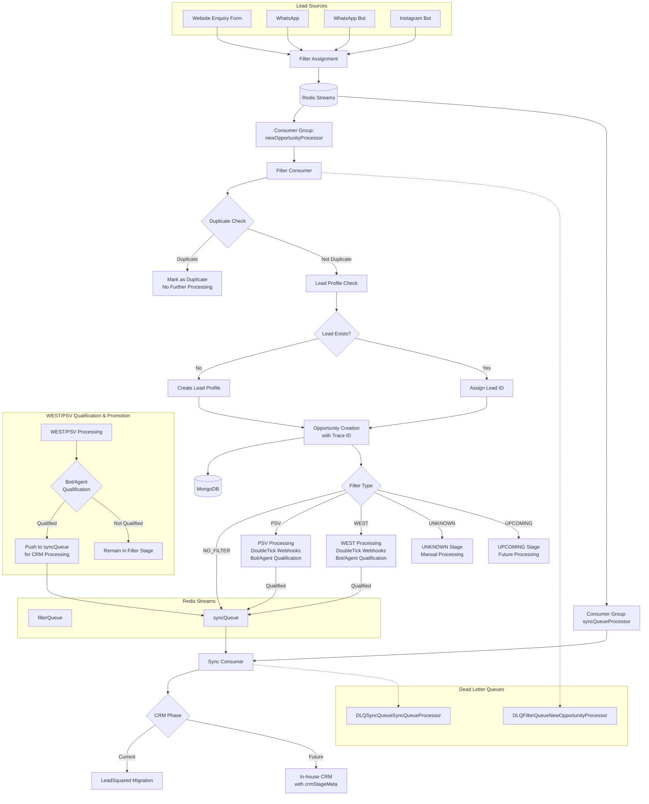

# Message Queues & Background Processing

## 📋 Overview
The Lead Processor system uses Redis Streams for message queuing and background processing to handle lead inquiries from multiple channels. The system processes leads through a sophisticated filtration mechanism, manages duplicate detection, creates user profiles, and synchronizes data with CRM systems. This enables asynchronous processing of leads, real-time updates, and scalable task distribution across multiple consumer instances.

## 🏗️ Complete Lead Processing Flow

### Lead Sources
- **Website Enquiry Form**: Direct form submissions from website
- **WhatsApp**: Direct WhatsApp messages
- **WhatsApp Bot**: Automated bot interactions
- **Instagram Bot**: Social media lead capture

### Processing Pipeline
1. **Lead Capture** → **Filter Assignment** → **Filter Queue**
2. **Filter Queue Processing** → **Duplicate Check** → **Lead/User Profile Management**
3. **Opportunity Creation** → **Filter-based Routing**
4. **CRM Synchronization** (for NO_FILTER and qualified opportunities)

## 🏗️ Queue Architecture



## 🚀 Queue Implementation

### Queue Configuration
```typescript
enum QueueNames {
  filterQueue = 'filterQueue',
  syncQueue = 'syncQueue'
}

enum ConsumerGroups {
  newOpportunityProcessor = 'newOpportunityProcessor',
  syncQueueProcessor = 'syncQueueProcessor'
}

interface IQueueConfig {
  maxRetries: number;
  claimTimeoutMs: number;
}

const QueueConfigs = new Map<string, IQueueConfig>([
  [`${QueueNames.filterQueue}_${ConsumerGroups.newOpportunityProcessor}`, {
    maxRetries: 5,
    claimTimeoutMs: 10000
  }],
  [`${QueueNames.syncQueue}_${ConsumerGroups.syncQueueProcessor}`, {
    maxRetries: 4,
    claimTimeoutMs: 10000
  }]
]);
```

### Message Queue Interface
```typescript
interface IMessageQueue {
  pushMessage(queue: string, message: string): Promise<void>;
  pullMessage(queue: QueueNames, group: ConsumerGroups, consumer: string): Promise<{
    id: string;
    message: { [x: string]: string };
  } | null>;
  ackMessage(queue: QueueNames, group: ConsumerGroups, messageId: string): Promise<void>;
  initializeConsumerGroup(queue: QueueNames, group: ConsumerGroups): Promise<void>;
  readMessagesFromLast(queue: QueueNames, time: string, count: number): Promise<string[]>;
  readAllPendingMessagesIdsForGroup(queue: QueueNames, consumerGroup: ConsumerGroups): Promise<string[]>;
}
```

## 📨 Queue Types & Usage

### 1. Filter Queue
**Purpose**: Process new lead inquiries through comprehensive filtration logic with duplicate detection and user profile management
**Flow**: Lead Capture → Filter Assignment → Duplicate Check → Lead Profile Management → Opportunity Creation → Filter-based Routing

**Message Format**: 
- **Source**: [`server/interfaces/leadReqPayload.interface.ts`](../../server/interfaces/leadReqPayload.interface.ts) - `LeadDataPayload`
- **Source Reference**: [`server/interfaces/leadSource.interface.ts`](../../server/interfaces/leadSource.interface.ts) - `ILeadSource`

**Producer Usage**:
```typescript
// From lead capture endpoints (Website, WhatsApp, Instagram Bot)
await messageQueue.pushMessage(
  QueueNames.filterQueue, 
  JSON.stringify({ source, leadData, salesPersonData })
);
```

**Consumer Flow**: See [Filter Queue Consumer](#filter-queue-consumer-actual-implementation) section above

### 2. Sync Queue
**Purpose**: Synchronize opportunities with CRM systems (LeadSquared migration → In-house CRM)
**Flow**: Opportunity Qualification → CRM Data Formatting → API Sync → Status Update with crmStageMeta

**Message Format**:
```typescript
interface SyncQueueMessage {
  _id: string;           // Opportunity ID
  traceID: string;       // Trace ID for tracking
  action?: 'CREATE' | 'UPDATE' | 'DELETE' | 'PROMOTE_FROM_FILTER';
  source?: string;       // Source of the sync request
}
```

**Producer Usage**:
```typescript
// From Filter Queue (NO_FILTER) or Filter Promotion (WEST/PSV qualified)
await messageQueue.pushMessage(
  QueueNames.syncQueue,
  JSON.stringify({
    _id: opportunity._id.toString(),
    traceID: opportunity.traceID,
    action: 'PROMOTE_FROM_FILTER',
    source: opportunity.filterationProcess
  })
);
```

**Consumer Flow**: See [Sync Queue Consumer](#sync-queue-consumer-actual-implementation) section above

## 🔄 Filter Promotion Flow - Sync Queue Push References

### WEST/PSV Qualification to CRM

#### 1. Regular WEST/PSV Qualification (Manual Agent/Bot)
**Source**: [`server/services/useCases/filterOpportunity.usecase.ts`](../../server/services/useCases/filterOpportunity.usecase.ts) - `qualifyFilteredOpportunity()` function

**File Reference**: Lines 771-778
- **Trigger**: Agent or bot manually qualifies WEST/PSV opportunity through qualification interface
- **Function**: `qualifyFilteredOpportunity()`
- **Push Logic**: 
  ```typescript
  await messageQueue.pushMessage(
    QueueNames.syncQueue,
    JSON.stringify({
      traceID: opportunity.traceID,
      _id: opportunity._id
    })
  );
  ```

#### 2. WEST AI Qualification (Automated Bot)
**Source**: [`server/services/useCases/filterOpportunity.usecase.ts`](../../server/services/useCases/filterOpportunity.usecase.ts) - `westAiQualifyOpportunity()` function

**File Reference**: Lines 2007-2014
- **Trigger**: WEST AI bot automatically qualifies opportunity based on phone and destination
- **Function**: `westAiQualifyOpportunity()`
- **API Endpoint**: `PATCH /:filtrationProcess/status/west_ai:qualify`
- **Push Logic**: Same message format as manual qualification

### UNKNOWN Filter Promotion

**Source**: [`server/services/useCases/opportunity.usecase.ts`](../../server/services/useCases/opportunity.usecase.ts) - `patchUpcomingOpportunity()` function

**File Reference**: Lines 717-725
- **Trigger**: Admin manually qualifies UNKNOWN opportunity through admin interface
- **Function**: `patchUpcomingOpportunity()` (handles both UNKNOWN and UPCOMING)
- **Status Transition**: Any UNKNOWN stage → `UNKNOWN_QUALIFIED` → Sync Queue
- **Push Logic**:
  ```typescript
  await messageQueue.pushMessage(
    QueueNames.syncQueue,
    JSON.stringify({
      traceId: opportunity.traceID,
      _id: opportunity._id
    })
  );
  ```

### UPCOMING Filter Promotion

**Source**: [`server/services/useCases/opportunity.usecase.ts`](../../server/services/useCases/opportunity.usecase.ts) - `patchUpcomingOpportunity()` function

**File Reference**: Lines 717-725
- **Trigger**: Admin manually qualifies UPCOMING opportunity after destination assignment
- **Function**: `patchUpcomingOpportunity()`
- **Status Transition**: Any UPCOMING stage → `UPCOMING_QUALIFIED` → Sync Queue
- **Required Conditions**:
  - Valid destination assigned (not UNKNOWN)
  - Sales person successfully assigned
- **Push Logic**: Same as UNKNOWN filter promotion

### NO_FILTER Direct Processing

**Source**: [`server/services/filterQueueConsumer.service.ts`](../../server/services/filterQueueConsumer.service.ts) - Filter Queue Consumer

**File Reference**: Lines 82 & 89
- **Trigger**: Opportunities assigned NO_FILTER during initial processing
- **Flow**: Direct push to sync queue during filter queue processing
- **Push Logic**:
  ```typescript
  await messageQueue.pushMessage(
    QueueNames.syncQueue, 
    JSON.stringify({ 
      _id: opportunity._id.toString(), 
      traceID: opportunity.traceID 
    })
  );
  ```

### Summary of Push Locations

| Filter Type | Source File | Function | Lines | Trigger |
|-------------|------------|----------|-------|---------|
| **WEST/PSV** | `filterOpportunity.usecase.ts` | `qualifyFilteredOpportunity()` | 771-778 | Manual agent/bot qualification |
| **WEST AI** | `filterOpportunity.usecase.ts` | `westAiQualifyOpportunity()` | 2007-2014 | Automated WEST AI qualification |
| **UNKNOWN** | `opportunity.usecase.ts` | `patchUpcomingOpportunity()` | 717-725 | Admin qualification |
| **UPCOMING** | `opportunity.usecase.ts` | `patchUpcomingOpportunity()` | 717-725 | Admin qualification |
| **NO_FILTER** | `filterQueueConsumer.service.ts` | Filter Consumer | 82, 89 | Direct processing |

## 🎯 Lead Processing Stages & States

### Filter Processing States
**Source**: [`server/entities/processDestinationMap/processDestinationMap.interface.ts`](../../server/entities/processDestinationMap/processDestinationMap.interface.ts) - `FiltrationProcess`
**Source**: [`server/entities/rawOpportunity/rawOpportunity.interface.ts`](../../server/entities/rawOpportunity/rawOpportunity.interface.ts) - `PSV_STAGES`, `WEST_STAGES`

**Filter Types**:
- **NO_FILTER**: Direct to CRM processing
- **PSV**: Pre-Sales Verification team processing 
- **WEST**: WEST team processing
- **UNKNOWN**: Manual review required
- **UPCOMING**: Future processing

**Stage Transitions**:
- **PSV/WEST**: FRESH_LEAD → IN_PROGRESS → QUALIFIED → (Promote to CRM)
- **NO_FILTER**: Direct to `syncQueue`
- **UNKNOWN/UPCOMING**: Manual intervention → (Promote to CRM when qualified)

### Opportunity Lifecycle
1. **Lead Capture**: From various sources (Website, WhatsApp, Instagram Bot)
2. **Filter Assignment**: Automatic assignment based on business rules
3. **Duplicate Check**: Phone number and email validation against existing records
4. **Profile Management**: Create or link to existing lead profile
5. **Opportunity Creation**: Generate with unique trace ID for tracking
6. **Filter Processing**: Route based on assigned filter type
7. **CRM Synchronization**: Push qualified opportunities to CRM system

### Trace ID Management
Every opportunity receives a unique `traceID` at creation time that follows it through the entire pipeline:
- **Lead Profile**: Captured in user profile if created via this lead
- **Queue Messages**: Included in all queue messages for tracking
- **CRM Records**: Synchronized with CRM for end-to-end traceability
- **Logging**: Used for correlation across all system components

## 🔄 Consumer Implementation

### Base Consumer Pattern
```typescript
class BaseConsumer {
  private isRunning = false;
  
  constructor(
    private messageQueue: IMessageQueue,
    private queueName: QueueNames,
    private consumerGroup: ConsumerGroups,
    private consumerId: string
  ) {}
  
  async start(): Promise<void> {
    this.isRunning = true;
    logger.info(`Starting consumer ${this.consumerId} for ${this.queueName}`);
    
    // Initialize consumer group if needed
    await this.messageQueue.initializeConsumerGroup(
      this.queueName, 
      this.consumerGroup
    );
    
    while (this.isRunning) {
      try {
        const message = await this.messageQueue.pullMessage(
          this.queueName,
          this.consumerGroup,
          this.consumerId
        );
        
        if (message) {
          await this.processMessage(message);
          await this.messageQueue.ackMessage(
            this.queueName,
            this.consumerGroup,
            message.id
          );
        } else {
          // No messages, brief pause
          await new Promise(resolve => setTimeout(resolve, 1000));
        }
      } catch (error) {
        logger.error(`Consumer error in ${this.consumerId}:`, error);
        await new Promise(resolve => setTimeout(resolve, 5000));
      }
    }
  }
  
  abstract processMessage(message: any): Promise<void>;
  
  stop(): void {
    this.isRunning = false;
  }
}
```

### Filter Queue Consumer (Actual Implementation)

**Source**: [`server/services/filterQueueConsumer.service.ts`](../../server/services/filterQueueConsumer.service.ts)

**Flow Description**:

1. **Message Processing Loop** (lines 25-30)
   - Consumer pulls messages from `filterQueue` using `newOpportunityProcessor` consumer group
   - Each message contains `source` and `leadData` from various lead sources

2. **Lead Profile Management** (lines 45-55)
   - Searches for existing lead by phone number using `leadRepo.findByPhone()`
   - Creates new lead profile if not found, or links to existing lead
   - Associates lead ID with the opportunity

3. **Ex-Client Scoring** (lines 57-65)
   - Checks if lead is an ex-client using `bookingService.isExClient()`
   - Adds "ex-client" tag and bonus scoring points if applicable

4. **Opportunity Creation** (lines 67-70)
   - Creates raw opportunity in MongoDB with lead association
   - Assigns unique trace ID for end-to-end tracking

5. **Filter-Based Routing** (lines 75-125)
   - **NO_FILTER**: Direct push to `syncQueue` for immediate CRM processing
   - **WEST**: Creates WEST lead, updates status, fires DoubleTick webhooks
   - **PSV**: Creates PSV lead, updates status for PSV processing  
   - **UNKNOWN/UPCOMING**: Remains in filter stage for manual processing

6. **Active Lead Management** (lines 127-135)
   - Adds opportunity to lead's active opportunities list (except UNKNOWN filter)
   - Maintains relationship between leads and their active opportunities

**Key Integration Points**:
- **DoubleTick Webhooks**: `doubleTickWebHookService.asyncWESTAssignment()` (line 105)
- **External Services**: `WESTService.createLead()`, `PSVService.createLead()` 
- **Queue Promotion**: Qualified opportunities → `syncQueue` for CRM processing
- **Error Handling**: Failed messages automatically retry based on queue configuration

### Sync Queue Consumer (Actual Implementation)

**Source**: [`server/services/syncQueueConsumer.service.ts`](../../server/services/syncQueueConsumer.service.ts)

**Flow Description**:

1. **Message Processing Setup** (lines 15-25)
   - Consumer pulls messages from `syncQueue` using `syncQueueProcessor` consumer group
   - Each message contains opportunity `_id` and `traceID` for tracking
   - Uses async local storage for request context correlation

2. **Opportunity Validation** (lines 35-45)
   - Retrieves opportunity from MongoDB using the provided ID
   - Skips UPCOMING destinations (marks as `UPCOMING_FRESH_LEAD` status)
   - Validates opportunity exists before processing

3. **Sales Person Assignment** (lines 50-60)
   - Checks if opportunity has `salesPersonToBeAssigned` but no owner
   - Retrieves sales person details from availability repository
   - Validates sales person has valid `leadSquadId` for CRM integration

4. **CRM Lead Existence Check** (lines 65-75)
   - Uses `crmService.checkIfLeadExistsFinal()` to check phone/email in CRM
   - Determines if new lead creation or existing lead association is needed
   - Handles both scenarios with appropriate CRM API calls

5. **CRM Opportunity Creation** (lines 80-110)
   - **New Lead Path**: Creates both lead and opportunity in CRM
   - **Existing Lead Path**: Creates only opportunity for existing CRM lead
   - Updates local lead record with CRM `leadSquadId` for future reference

6. **Opportunity Status Update** (lines 115-130)
   - Updates opportunity with CRM details (`leadSquadId`, `isPushed: true`)
   - Sets `crmPlatform` to `INHOUSE_CRM` and adds `crmStageMeta`
   - Assigns opportunity owner and operation source for audit trail

7. **Follow-up Management** (lines 135-150)
   - Creates initial follow-up if none exists for `FRESH_LEAD` stage
   - Sets 24-hour reminder for sales person engagement
   - Uses user context for proper follow-up creation

8. **Change Tracking** (lines 155-165)
   - Captures opportunity changes using `changeCaptureService`
   - Records CRM push activity for audit and compliance
   - Handles errors gracefully without blocking main flow

**Key Integration Points**:
- **CRM Service**: `crmService.createLead()`, `crmService.createOpportunity()` 
- **Lead Repository**: Updates local lead with CRM ID synchronization
- **Follow-up System**: Automated follow-up creation for sales engagement
- **Change Capture**: Audit trail for all CRM synchronization activities
- **Error Handling**: Comprehensive error logging and retry via queue configuration

## 🏢 CRM Integration & Migration

### LeadSquared Migration → In-house CRM
The system is currently in a migration phase from LeadSquared to an in-house CRM solution:

**Source References**:
- **CRM Platform Enums**: [`server/entities/rawOpportunity/rawOpportunity.interface.ts`](../../server/entities/rawOpportunity/rawOpportunity.interface.ts) - `CrmPlatform`, `CrmLeadStage`, `CrmLeadJourneyCheckPoints`
- **CRM Service**: [`server/services/crm.service.ts`](../../server/services/crm.service.ts)
- **CRM Stage Metadata**: Interface `CrmStageMeta` in opportunity entity

**Migration Context**:
- **Legacy**: LeadSquared API integration (migration phase)
- **Target**: In-house CRM with enhanced stage tracking
- **Dual Support**: Current system supports both platforms during transition

### CRM Processing Flow
1. **Opportunity Qualification**: Filtered opportunities with assigned destinations
2. **Sales Person Assignment**: Matching with available sales personnel
3. **CRM Lead Management**: 
   - Check for existing leads (phone/email)
   - Create new lead or associate with existing
   - Generate CRM opportunity
4. **Stage Metadata Attachment**: Track progress through CRM stages
5. **Follow-up Management**: Automated follow-up scheduling

### Filter Promotion to CRM
Filtered opportunities (PSV, WEST, UNKNOWN, UPCOMING) can be promoted to CRM phase when:
- **Qualification Complete**: Lead meets qualification criteria
- **Destination Assigned**: Target destination is determined
- **Details Gathered**: Sufficient information collected

```typescript
// Promotion Process
const promoteFilteredOpportunity = async (opportunityId: string) => {
  const opportunity = await rawOpportunityRepo.getById(opportunityId);
  
  // Validation checks
  if (isQualified(opportunity) && hasDestination(opportunity)) {
    // Push to sync queue for CRM processing
    await messageQueue.pushMessage(
      QueueNames.syncQueue,
      JSON.stringify({
        _id: opportunity._id.toString(),
        traceID: opportunity.traceID,
        action: 'PROMOTE',
        source: 'FILTER_PROMOTION'
      })
    );
    
    // Update opportunity status
    await rawOpportunityRepo.update(opportunityId, {
      status: OpportunityStatus.PROMOTED_TO_CRM,
      promotedAt: new Date()
    });
  }
};
```

## � Duplicate Detection & Management

### Duplicate Check Process
The system performs comprehensive duplicate detection to prevent processing the same lead multiple times:


## 🔍 Duplicate Detection & Management

### Duplicate Check Process
The system performs comprehensive duplicate detection to prevent processing the same lead multiple times:

**Implementation**: 
- **Source**: [`server/services/processLeads.service.ts`](../../server/services/processLeads.service.ts) - `preProcessOpportunity()`
- **Repository Methods**: `rawOpportunityRepo.findByPhone()`, `rawOpportunityRepo.findByEmail()`

**Detection Strategy**:
1. **Phone Number Priority**: Primary identifier for duplicate detection
2. **Email Validation**: Secondary check for email-based duplicates  
3. **Business Rule Checks**: Name + destination combination validation
4. **Early Termination**: Duplicates marked and processing stops immediately
5. **Audit Trail**: All duplicate decisions logged with reasoning

**Flow Impact**:
- **Duplicate Found**: Mark as duplicate → Stop processing → Acknowledge message
- **No Duplicate**: Continue with normal lead processing flow
- **Database Update**: Duplicate opportunities still created for audit purposes


### Duplicate Handling Strategy
1. **Phone Number Priority**: Primary identifier for duplicate detection
2. **Email Validation**: Secondary check for email-based duplicates
3. **Business Rule Checks**: Name + destination combination validation
4. **No Further Processing**: Duplicates are marked and stopped in the pipeline
5. **Audit Trail**: All duplicate decisions are logged for review

## �🔧 Error Handling & Retry Logic
```typescript
const shouldDLQ = (deliveryCount: number, delay: number, retryConfig: IQueueConfig): boolean => {
  return deliveryCount >= retryConfig.maxRetries && delay >= retryConfig.claimTimeoutMs;
};

const shouldClaim = (deliveryCount: number, delay: number, retryConfig: IQueueConfig): boolean => {
  return deliveryCount < retryConfig.maxRetries && delay >= retryConfig.claimTimeoutMs;
};

// In pullMessage implementation
const pendingDetails = await redisClient.xPendingRange(
  queue, 
  group, 
  startId, 
  endId, 
  count
);

for (const { deliveriesCounter, id: messageId, millisecondsSinceLastDelivery } of pendingDetails) {
  const pushToDLQ = shouldDLQ(deliveriesCounter, millisecondsSinceLastDelivery, retryConfig);
  
  if (pushToDLQ) {
    // Move to Dead Letter Queue
    const dlqQueue = generateDLQueueName(queue, group);
    const claimedMessage = await redisClient.xClaim(queue, group, consumer, 1000, messageId);
    
    if (claimedMessage && claimedMessage.length > 0) {
      await redisClient.xAdd(dlqQueue, '*', { 
        message: claimedMessage[0].message.message,
        originalQueue: queue,
        failedAt: new Date().toISOString(),
        retryCount: deliveriesCounter
      });
      
      await this.ackMessage(queue, group, messageId);
      logger.warn(`Message ${messageId} moved to DLQ ${dlqQueue}`);
    }
  }
}
```

### Dead Letter Queue (DLQ) Management
```typescript
const generateDLQueueName = (queue: QueueNames, group: ConsumerGroups): string => {
  return `DLQ${upperfirst(queue)}${upperfirst(group)}`;
};

// DLQ Processing (manual intervention)
const processDLQ = async (dlqName: string) => {
  const messages = await redisClient.xRange(dlqName, '-', '+');
  
  for (const message of messages) {
    try {
      // Attempt reprocessing with manual review
      const originalMessage = JSON.parse(message.message.message);
      await manualReprocessMessage(originalMessage);
      
      // Remove from DLQ if successful
      await redisClient.xDel(dlqName, message.id);
    } catch (error) {
      logger.error(`DLQ reprocessing failed for ${message.id}:`, error);
    }
  }
};
```

## 📊 Monitoring & Metrics

### Queue Health Monitoring
```typescript
// Queue metrics collection
interface QueueMetrics {
  queueLength: number;
  pendingMessages: number;
  consumerLag: number;
  processingRate: number;
  errorRate: number;
  dlqSize: number;
}

const getQueueMetrics = async (
  queueName: QueueNames, 
  consumerGroup: ConsumerGroups
): Promise<QueueMetrics> => {
  // Queue length
  const queueInfo = await redisClient.xInfoStream(queueName);
  const queueLength = queueInfo.length;
  
  // Pending messages
  const pendingSummary = await redisClient.xPending(queueName, consumerGroup);
  const pendingMessages = pendingSummary.pending;
  
  // DLQ size
  const dlqName = generateDLQueueName(queueName, consumerGroup);
  const dlqInfo = await redisClient.xInfoStream(dlqName);
  const dlqSize = dlqInfo.length;
  
  return {
    queueLength,
    pendingMessages,
    consumerLag: pendingMessages, // Simplified
    processingRate: 0, // Calculate from historical data
    errorRate: 0, // Calculate from DLQ growth
    dlqSize
  };
};
```

### Performance Tracking
```typescript
// Message processing time tracking
const trackProcessingTime = (queueName: string, processingTime: number) => {
  // Send to metrics system (Prometheus, etc.)
  prometheusMetrics.histogram
    .labels({ queue: queueName })
    .observe(processingTime);
};

// Queue depth monitoring
const monitorQueueDepth = async () => {
  for (const queue of Object.values(QueueNames)) {
    const info = await redisClient.xInfoStream(queue);
    
    prometheusMetrics.gauge
      .labels({ queue })
      .set(info.length);
  }
};
```

## 📈 System Metrics & KPIs

### Lead Processing Metrics
```typescript
interface LeadProcessingMetrics {
  // Volume Metrics
  totalLeadsReceived: number;
  leadsBySource: Record<string, number>;  // Website, WhatsApp, Instagram, etc.
  
  // Processing Metrics
  duplicateRate: number;
  filterDistribution: Record<FiltrationProcess, number>;
  avgProcessingTime: number;
  
  // Quality Metrics
  crmConversionRate: number;
  qualificationRate: number;
  responseTime: number;
  
  // Error Metrics
  processingErrors: number;
  dlqSize: number;
  retryRate: number;
}

// Metrics Collection
const collectProcessingMetrics = async (): Promise<LeadProcessingMetrics> => {
  const timeRange = '24h';  // Last 24 hours
  
  // Get messages from filterQueue for the time range
  const filterMessages = await messageQueue.readMessagesFromLast(
    QueueNames.filterQueue, 
    timeRange, 
    1000
  );
  
  // Analyze message content
  const sourceDistribution = filterMessages.reduce((acc, msg) => {
    const { source } = JSON.parse(msg);
    acc[source.type] = (acc[source.type] || 0) + 1;
    return acc;
  }, {});
  
  // Calculate processing metrics
  const duplicates = await rawOpportunityRepo.countDuplicatesInTimeRange(timeRange);
  const filterDist = await rawOpportunityRepo.getFilterDistribution(timeRange);
  
  return {
    totalLeadsReceived: filterMessages.length,
    leadsBySource: sourceDistribution,
    duplicateRate: duplicates / filterMessages.length,
    filterDistribution: filterDist,
    avgProcessingTime: await calculateAvgProcessingTime(timeRange),
    crmConversionRate: await calculateCrmConversionRate(timeRange),
    qualificationRate: await calculateQualificationRate(timeRange),
    responseTime: await calculateResponseTime(timeRange),
    processingErrors: await getDLQSize(),
    dlqSize: await getDLQSize(),
    retryRate: await calculateRetryRate(timeRange)
  };
};
```

## 🚨 Alerting & Monitoring

### Critical Alerts
```typescript
// Queue Monitoring Alerts
const checkQueueHealth = async () => {
  const queues = [QueueNames.filterQueue, QueueNames.syncQueue, QueueNames.afterWestAndPsvQueue];
  
  for (const queue of queues) {
    const metrics = await getQueueMetrics(queue, getConsumerGroup(queue));
    
    // Alert conditions
    if (metrics.queueLength > 1000) {
      await sendAlert({
        type: 'QUEUE_BACKLOG',
        queue,
        current: metrics.queueLength,
        threshold: 1000,
        severity: 'HIGH'
      });
    }
    
    if (metrics.dlqSize > 50) {
      await sendAlert({
        type: 'DLQ_OVERFLOW',
        queue,
        current: metrics.dlqSize,
        threshold: 50,
        severity: 'CRITICAL'
      });
    }
    
    if (metrics.pendingMessages > 100) {
      await sendAlert({
        type: 'PENDING_MESSAGES',
        queue,
        current: metrics.pendingMessages,
        threshold: 100,
        severity: 'MEDIUM'
      });
    }
  }
};

// Processing Performance Alerts
const checkProcessingPerformance = async () => {
  const metrics = await collectProcessingMetrics();
  
  // Duplicate rate alert
  if (metrics.duplicateRate > 0.3) {  // 30% duplicates
    await sendAlert({
      type: 'HIGH_DUPLICATE_RATE',
      current: metrics.duplicateRate,
      threshold: 0.3,
      severity: 'MEDIUM'
    });
  }
  
  // Processing time alert
  if (metrics.avgProcessingTime > 30000) {  // 30 seconds
    await sendAlert({
      type: 'SLOW_PROCESSING',
      current: metrics.avgProcessingTime,
      threshold: 30000,
      severity: 'HIGH'
    });
  }
  
  // Conversion rate alert
  if (metrics.crmConversionRate < 0.7) {  // 70% conversion
    await sendAlert({
      type: 'LOW_CONVERSION_RATE',
      current: metrics.crmConversionRate,
      threshold: 0.7,
      severity: 'MEDIUM'
    });
  }
};
```

## 🚀 Scaling Considerations

### Horizontal Scaling
```typescript
// Multiple consumer instances
const startConsumerCluster = (instanceCount: number) => {
  for (let i = 0; i < instanceCount; i++) {
    const consumerId = `filter-consumer-${i}`;
    
    // Each consumer runs in separate process/container
    processFilterQueue(messageQueue, consumerId);
  }
};

// Consumer group ensures message distribution
// Redis Streams automatically load-balances across consumers
```

### Performance Optimization
```typescript
// Batch processing for efficiency
const processBatch = async (batchSize: number = 10) => {
  const messages = [];
  
  for (let i = 0; i < batchSize; i++) {
    const message = await messageQueue.pullMessage(queue, group, consumer);
    if (message) messages.push(message);
    else break;
  }
  
  if (messages.length > 0) {
    await processBatchOfMessages(messages);
    
    // Acknowledge all messages
    for (const message of messages) {
      await messageQueue.ackMessage(queue, group, message.id);
    }
  }
};
```
