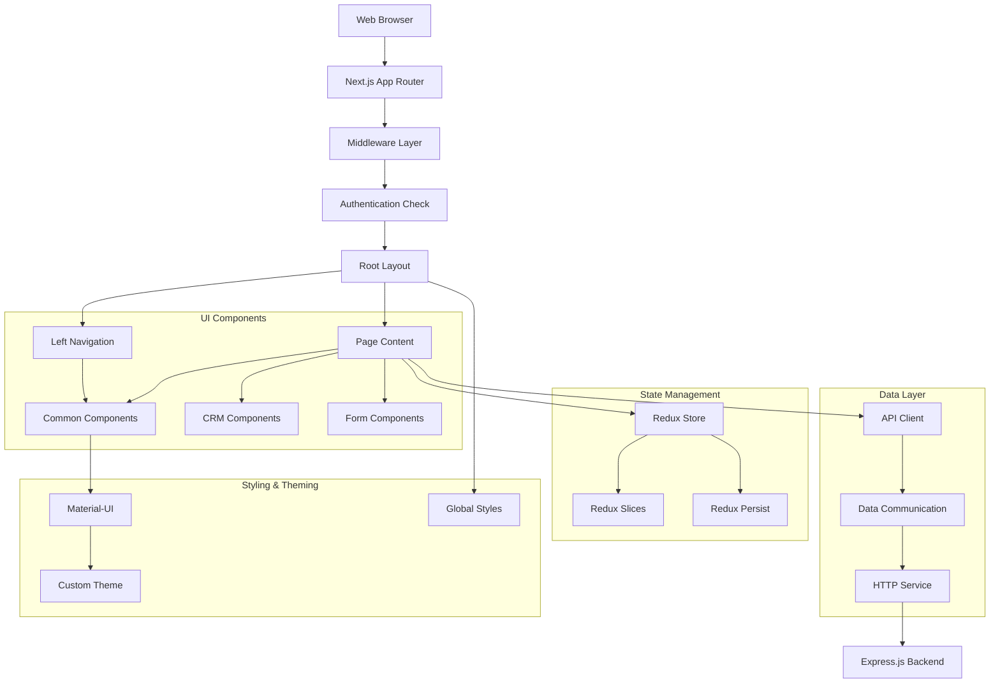
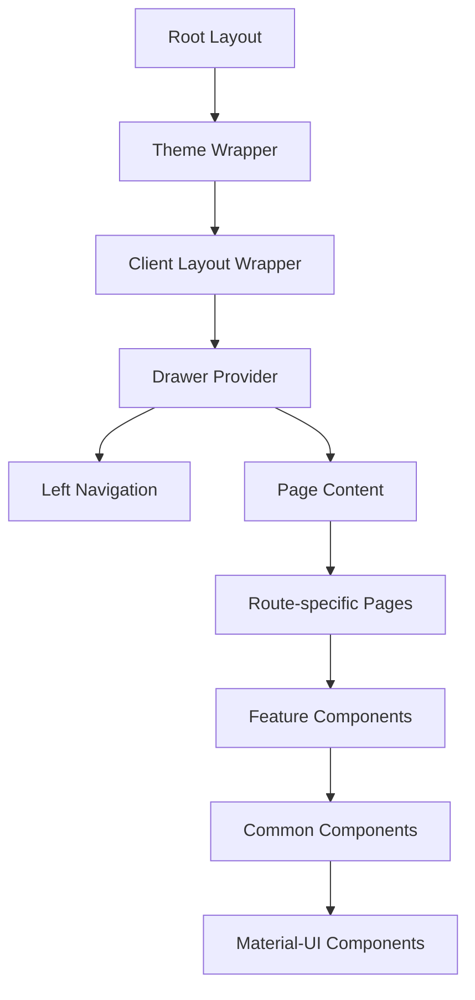
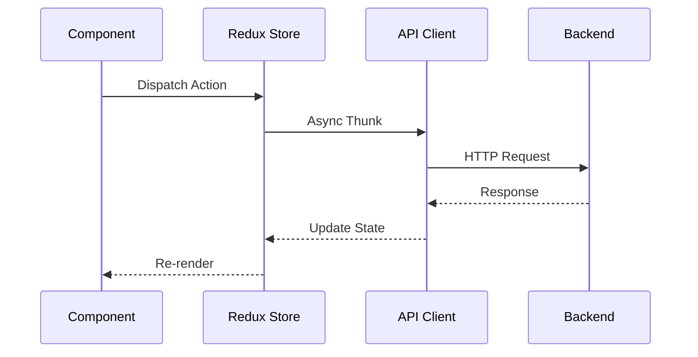

# Frontend Architecture

## 📋 Overview
The Lead Processor frontend is built with Next.js 14+ using the App Router architecture, TypeScript, and Material-UI. It follows a component-based architecture with Redux for state management and a feature-driven folder structure.

## 🏗️ Architecture Diagram



## 🗂️ Project Structure

```
app/
├── layout.tsx                      # Root layout with providers
├── page.tsx                        # Home page
├── ThemeWrapper.tsx                 # Theme and toast provider
├── middleware.ts                    # Route protection middleware
├── (routes)/                       # Route groups
│   ├── loading.tsx                 # Global loading component
│   ├── crm/                        # CRM-related pages
│   │   ├── opportunities/          # Opportunity management
│   │   ├── new-opportunities/      # New opportunities processing
│   │   └── layout.tsx              # CRM section layout
│   ├── destination-marking/        # Destination assignment
│   ├── enquiry/                    # Enquiry management
│   ├── in-filtration/              # Lead filtration
│   ├── login/                      # Authentication
│   ├── team-availability/          # Team management
│   └── url-marking/                # URL ranking management
├── _components/                    # Reusable components
│   ├── ClientLayoutWrapper.tsx     # Client-side layout wrapper
│   ├── Common/                     # Generic components
│   │   ├── AvailabilityTable.tsx   # Team availability display
│   │   ├── CustomChips.tsx         # Custom chip components
│   │   ├── LeftNav.tsx             # Navigation sidebar
│   │   ├── PersonCrudModal.tsx     # Person management modal
│   │   └── ...                     # Other common components
│   ├── CommonComponents/           # Shared UI components
│   ├── CrmComponents/              # CRM-specific components
│   │   ├── OpportunityTable.tsx    # Opportunity listing
│   │   ├── StatusUpdateModal.tsx   # Status change modal
│   │   ├── NotesModal.tsx          # Notes management
│   │   └── ...                     # Other CRM components
│   ├── FiltrationProcessComponents/ # Lead filtration UI
│   ├── MarkDestinationComponents/  # Destination marking UI
│   └── Navigation/                 # Navigation components
├── _context/                       # React contexts
│   └── DrawerContext.tsx           # Navigation drawer state
├── _redux/                         # Redux store setup
│   ├── store.ts                    # Store configuration
│   ├── SessionProvider.tsx         # Redux session provider
│   ├── features/                   # Feature-based slices
│   └── slices/                     # Redux slices
│       ├── crmOpportunityListSlice.ts # CRM opportunity state
│       └── ...                     # Other slices
├── _styles/                        # Global styles
│   ├── globals.css                 # Global CSS
│   ├── CommonStyles.ts             # Shared style definitions
│   └── ...                         # Other style files
├── _theme/                         # Material-UI theming
│   ├── theme.ts                    # Main theme configuration
│   ├── styles.ts                   # Component styles
│   └── ...                         # Theme-related files
├── _types/                         # TypeScript type definitions
│   ├── commonTypes.ts              # Shared types
│   └── ...                         # Other type files
├── _utils/                         # Utility functions
│   ├── helper.ts                   # General helpers
│   ├── istTime.ts                  # Time zone utilities
│   └── hooks/                      # Custom React hooks
├── api/                            # API route handlers (if any)
├── lib/                            # Shared libraries
│   ├── dataCom/                    # Data communication layer
│   │   ├── availability.dataCom.ts # Availability API calls
│   │   ├── auth.dataCom.ts         # Authentication API
│   │   ├── opportunities.dataCom.ts # Opportunity API calls
│   │   └── ...                     # Other API modules
│   ├── httpService.ts              # HTTP client abstraction
│   └── util/                       # Utility functions
│       ├── roleUtils.ts            # Role-based access control
│       └── ...                     # Other utilities
└── config/                         # Configuration files
```

## 🎨 Component Architecture

### Component Hierarchy


### Component Types

#### 1. Layout Components
```typescript
// app/layout.tsx - Root layout with providers
export default function RootLayout({
  children,
}: {
  children: React.ReactNode;
}) {
  return (
    <html lang="en">
      <body>
        <ThemeWrapper>
          <CssBaseline />
          <DrawerProvider>
            <ClientLayoutWrapper>
              <Box sx={{ display: 'flex' }}>
                <LeftNav />
                <Box component="main" sx={{ flexGrow: 1, p: 3 }}>
                  {children}
                </Box>
              </Box>
            </ClientLayoutWrapper>
          </DrawerProvider>
        </ThemeWrapper>
      </body>
    </html>
  );
}
```

#### 2. Page Components
```typescript
// app/(routes)/crm/opportunities/page.tsx
'use client';

export default function OpportunitiesPage() {
  const dispatch = useAppDispatch();
  const opportunities = useSelector(selectOpportunities);
  const loading = useSelector(selectLoading);
  
  useEffect(() => {
    dispatch(fetchOpportunities());
  }, []);
  
  return (
    <Box>
      <Typography variant="h4">Opportunities</Typography>
      {loading ? (
        <CircularProgress />
      ) : (
        <OpportunityTable opportunities={opportunities} />
      )}
    </Box>
  );
}
```

#### 3. Feature Components
```typescript
// app/_components/CrmComponents/OpportunityTable.tsx
interface OpportunityTableProps {
  opportunities: Opportunity[];
  onStatusUpdate?: (id: string, status: string) => void;
  onRowClick?: (opportunity: Opportunity) => void;
}

export default function OpportunityTable({ 
  opportunities, 
  onStatusUpdate,
  onRowClick 
}: OpportunityTableProps) {
  const [selectedRows, setSelectedRows] = useState<string[]>([]);
  
  return (
    <TableContainer component={Paper}>
      <Table>
        <TableHead>
          {/* Table headers */}
        </TableHead>
        <TableBody>
          {opportunities.map((opportunity) => (
            <TableRow key={opportunity._id}>
              {/* Table cells */}
            </TableRow>
          ))}
        </TableBody>
      </Table>
    </TableContainer>
  );
}
```

#### 4. Common/Shared Components
```typescript
// app/_components/CommonComponents/CustomChips.tsx
interface CustomChipProps {
  label: string;
  variant?: 'default' | 'success' | 'warning' | 'error';
  size?: 'small' | 'medium';
  onClick?: () => void;
}

export default function CustomChip({ 
  label, 
  variant = 'default', 
  size = 'medium',
  onClick 
}: CustomChipProps) {
  const getChipColor = () => {
    switch (variant) {
      case 'success': return theme.palette.success.main;
      case 'warning': return theme.palette.warning.main;
      case 'error': return theme.palette.error.main;
      default: return theme.palette.primary.main;
    }
  };
  
  return (
    <Chip
      label={label}
      size={size}
      onClick={onClick}
      sx={{ backgroundColor: getChipColor() }}
    />
  );
}
```

## 🔄 Data Flow Architecture

### Client-Server Communication


### State Management Flow
```typescript
// Data flow example for opportunity loading
export const fetchOpportunities = createAsyncThunk(
  'opportunities/fetchOpportunities',
  async (params: OpportunityFilters) => {
    const response = await getCrmOpportunities(params);
    return response.data;
  }
);

// In component
const dispatch = useAppDispatch();
const { opportunities, loading, error } = useSelector(selectOpportunityState);

useEffect(() => {
  dispatch(fetchOpportunities({ stage: 'NEW', limit: 20 }));
}, [dispatch]);
```

## 🎨 Styling Architecture

### Theme System
```typescript
// app/_theme/theme.ts
const theme = createTheme({
  palette: {
    primary: {
      main: '#01AFD1',
      light: '#4DD0E7',
      dark: '#018EA3',
    },
    secondary: {
      main: '#FF6B35',
    },
    customColors: {
      superDark: '#1A1A1A',
      lightGray: '#F5F5F5',
      successLight: '#E8F5E8',
    },
  },
  typography: {
    fontFamily: '"Roboto", "Helvetica", "Arial", sans-serif',
    h1: {
      fontSize: '2.5rem',
      fontWeight: 600,
    },
    h4: {
      fontSize: '1.5rem',
      fontWeight: 500,
    },
  },
  components: {
    MuiButton: {
      styleOverrides: {
        root: {
          borderRadius: 8,
          textTransform: 'none',
        },
      },
    },
    MuiTableCell: {
      styleOverrides: {
        root: {
          borderBottom: '1px solid #E0E0E0',
        },
      },
    },
  },
});
```

### Responsive Design Patterns
```typescript
// app/_styles/CommonStyles.ts
export const responsiveStyles = {
  container: {
    padding: {
      xs: '16px',
      sm: '24px',
      md: '32px',
    },
    maxWidth: {
      xs: '100%',
      lg: '1200px',
    },
  },
  
  table: {
    '& .MuiTableContainer-root': {
      maxHeight: {
        xs: '400px',
        md: '600px',
      },
    },
  },
  
  sidebar: {
    width: {
      xs: '100%',
      md: '250px',
    },
    display: {
      xs: 'none',
      md: 'block',
    },
  },
};
```

## 🔧 Performance Optimizations

### Code Splitting
```typescript
// Lazy loading for routes
const OpportunitiesPage = lazy(() => import('./opportunities/page'));
const AvailabilityPage = lazy(() => import('./team-availability/page'));

// Component-level lazy loading
const HeavyChart = lazy(() => import('../components/HeavyChart'));

function Dashboard() {
  return (
    <Suspense fallback={<CircularProgress />}>
      <HeavyChart />
    </Suspense>
  );
}
```

### Memoization Patterns
```typescript
// Memoized selectors
const selectFilteredOpportunities = createSelector(
  [selectOpportunities, selectFilters],
  (opportunities, filters) => {
    return opportunities.filter(opp => 
      (!filters.stage || opp.stage === filters.stage) &&
      (!filters.salesPerson || opp.salesPerson._id === filters.salesPerson)
    );
  }
);

// Memoized components
const OpportunityRow = memo(({ opportunity, onUpdate }: OpportunityRowProps) => {
  return (
    <TableRow>
      {/* Row content */}
    </TableRow>
  );
});

// Callback memoization
const handleStatusUpdate = useCallback(
  (opportunityId: string, newStatus: string) => {
    dispatch(updateOpportunityStatus({ id: opportunityId, status: newStatus }));
  },
  [dispatch]
);
```

### Virtual Scrolling
```typescript
// For large data sets
import { FixedSizeList as List } from 'react-window';

const VirtualizedTable = ({ items }: { items: Opportunity[] }) => {
  const Row = ({ index, style }: { index: number; style: CSSProperties }) => (
    <div style={style}>
      <OpportunityRow opportunity={items[index]} />
    </div>
  );

  return (
    <List
      height={600}
      itemCount={items.length}
      itemSize={50}
      itemData={items}
    >
      {Row}
    </List>
  );
};
```

## 📱 Responsive Design Strategy

### Breakpoint System
```typescript
// Material-UI breakpoints
const breakpoints = {
  xs: 0,     // Extra small devices
  sm: 600,   // Small devices
  md: 900,   // Medium devices
  lg: 1200,  // Large devices
  xl: 1536,  // Extra large devices
};

// Usage in components
const useResponsiveDesign = () => {
  const theme = useTheme();
  const isMobile = useMediaQuery(theme.breakpoints.down('md'));
  const isTablet = useMediaQuery(theme.breakpoints.between('md', 'lg'));
  
  return { isMobile, isTablet };
};
```

### Mobile-First Approach
```typescript
// Mobile-optimized components
const MobileOptimizedTable = () => {
  const { isMobile } = useResponsiveDesign();
  
  if (isMobile) {
    return <OpportunityCards opportunities={opportunities} />;
  }
  
  return <OpportunityTable opportunities={opportunities} />;
};

// Responsive navigation
const ResponsiveNavigation = () => {
  const [drawerOpen, setDrawerOpen] = useState(false);
  const { isMobile } = useResponsiveDesign();
  
  return (
    <>
      {isMobile ? (
        <Drawer
          anchor="left"
          open={drawerOpen}
          onClose={() => setDrawerOpen(false)}
        >
          <NavigationContent />
        </Drawer>
      ) : (
        <Box sx={{ width: 250 }}>
          <NavigationContent />
        </Box>
      )}
    </>
  );
};
```

## 🔒 Authentication & Authorization

### Route Protection
```typescript
// middleware.ts - Route protection
export async function middleware(req: NextRequest): Promise<NextResponse> {
  const { pathname } = req.nextUrl;
  
  // Public paths
  if (isPublicPath(pathname) || isExcludedPath(pathname)) {
    return NextResponse.next();
  }
  
  // Check session
  const sessionValid = await checkSession(req.cookies.get('authToken')?.value);
  
  if (!sessionValid) {
    return NextResponse.redirect(new URL('/login', req.url));
  }
  
  // Check role-based access
  const userProfile = await fetchProfile(req.cookies.get('authToken')?.value);
  const hasAccess = isRouteAccessible(pathname, getUserRole(userProfile));
  
  if (!hasAccess) {
    return NextResponse.redirect(new URL('/unauthorized', req.url));
  }
  
  return NextResponse.next();
}
```

### Role-Based UI
```typescript
// Role-based component rendering
const RoleBasedComponent = ({ children, requiredRole }: RoleBasedProps) => {
  const userRole = useSelector(selectUserRole);
  
  if (!hasPermission(userRole, requiredRole)) {
    return <AccessDenied />;
  }
  
  return <>{children}</>;
};

// Usage
<RoleBasedComponent requiredRole="ADMIN">
  <AdminPanel />
</RoleBasedComponent>
```

## 🛠️ Development Patterns

### Custom Hooks
```typescript
// Custom hook for API data fetching
const useOpportunities = (filters: OpportunityFilters) => {
  const [data, setData] = useState<Opportunity[]>([]);
  const [loading, setLoading] = useState(false);
  const [error, setError] = useState<string | null>(null);
  
  useEffect(() => {
    const fetchData = async () => {
      setLoading(true);
      try {
        const response = await getCrmOpportunities(filters);
        setData(response.data.opportunities);
        setError(null);
      } catch (err) {
        setError(err.message);
      } finally {
        setLoading(false);
      }
    };
    
    fetchData();
  }, [filters]);
  
  return { data, loading, error };
};

// Custom hook for form handling
const useOpportunityForm = (initialData?: Opportunity) => {
  const [formData, setFormData] = useState(initialData || {});
  const [errors, setErrors] = useState<Record<string, string>>({});
  
  const handleChange = (field: string, value: any) => {
    setFormData(prev => ({ ...prev, [field]: value }));
    if (errors[field]) {
      setErrors(prev => ({ ...prev, [field]: '' }));
    }
  };
  
  const validate = () => {
    const newErrors = validateOpportunity(formData);
    setErrors(newErrors);
    return Object.keys(newErrors).length === 0;
  };
  
  return { formData, errors, handleChange, validate };
};
```

### Error Boundaries
```typescript
// Error boundary for component error handling
class OpportunityErrorBoundary extends Component<
  { children: ReactNode },
  { hasError: boolean; error?: Error }
> {
  constructor(props: { children: ReactNode }) {
    super(props);
    this.state = { hasError: false };
  }
  
  static getDerivedStateFromError(error: Error) {
    return { hasError: true, error };
  }
  
  componentDidCatch(error: Error, errorInfo: ErrorInfo) {
    console.error('Opportunity component error:', error, errorInfo);
    // Send to error reporting service
  }
  
  render() {
    if (this.state.hasError) {
      return (
        <Box p={3}>
          <Alert severity="error">
            Something went wrong loading opportunities. Please refresh the page.
          </Alert>
        </Box>
      );
    }
    
    return this.props.children;
  }
}
```

This frontend architecture provides a solid foundation for building a scalable, maintainable React application with proper separation of concerns, performance optimization, and user experience considerations.
