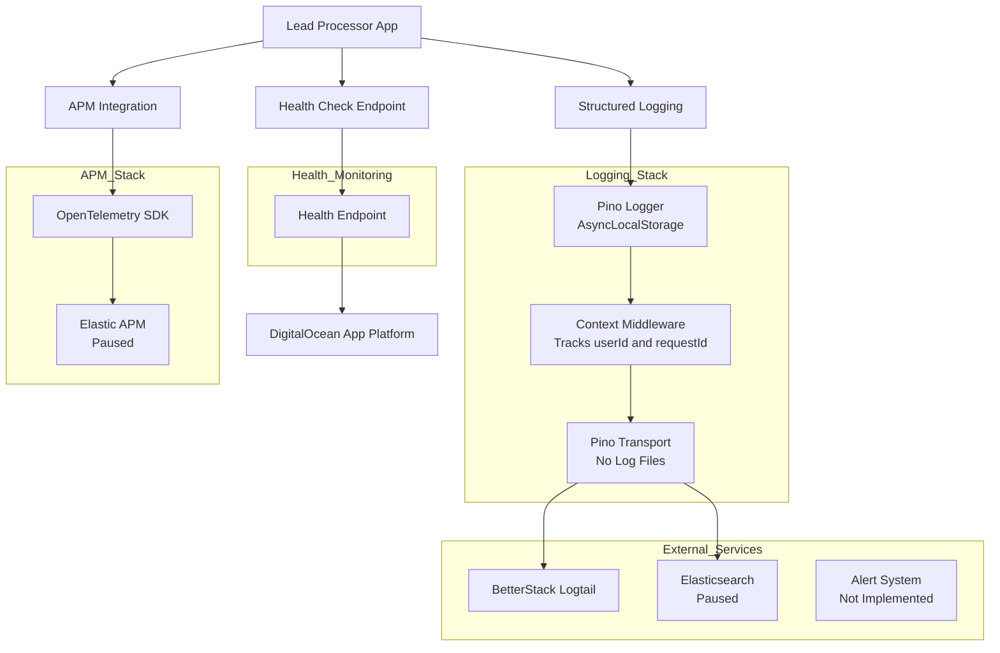

# Monitoring & Logging
## 📊 Overview

The Lead Processor system leverages **OpenTelemetry for APM (paused)** and **Pino-based structured logging** with centralized log aggregation using **BetterStack (Logtail)** and optionally **Elasticsearch**. Logs are enriched with `requestId`, `userId`, and `traceId` for correlation across requests and async tasks. Health checks are consumed by **DigitalOcean App Platform** to determine system liveness.

---

## 🏗️ Monitoring Architecture



---

## 📝 Centralized Logging

### **Context Propagation Middleware**

```typescript
// requestContextMiddleware.ts
import { Request, Response, NextFunction } from 'express';
import { randomUUID } from 'crypto';
import asyncLocalStorage, { RequestContext } from '../common/requestContext';

export function requestContextMiddleware(req: Request, _res: Response, next: NextFunction) {
  const context: RequestContext = {
    requestId: req.headers['x-request-id'] as string || randomUUID(),
    token: (req.signedCookies && req.signedCookies.token) || (req.cookies && req.cookies.token) || "",
    // userId is populated later (e.g., via auth guard)
  };
  asyncLocalStorage.run(context, () => next());
}
```

---

### **HTTP Request Logger**

```typescript
// requestLogger.middleware.ts
import { Request, Response, NextFunction } from 'express';
import { IBaseLogger } from '../interfaces/baseLogger.interface';

export function createRequestLogger(logger: IBaseLogger) {
    return (req: Request, res: Response, next: NextFunction) => {
        const start = process.hrtime.bigint();

        logger.info({
            method: req.method,
            url: req.originalUrl,
            route: req.path,
            ip: req.ip,
            headers: req.headers,
        }, 'HTTP request start');

        res.on('finish', () => {
            const durationMs = Number(process.hrtime.bigint() - start) / 1_000_000;
            logger.info({
                route: req.path,
                method: req.method,
                url: req.originalUrl,
                status: res.statusCode,
                timeTaken: durationMs,
                ip: req.ip,
            }, 'HTTP request complete');
        });
        next();
    };
}
```

---

### **Root Logger with Transports**

```typescript
// rootLogger.ts
import pino from 'pino';
import pinoCaller from 'pino-caller';
import asyncLocalStorage from './requestContext';
import { trace, context } from '@opentelemetry/api';

function getContextBindings() {
  const store = asyncLocalStorage.getStore();
  const span = trace.getSpan(context.active());
  const trace_id = span?.spanContext().traceId || null;
  const span_id = span?.spanContext().spanId || null;
  
  return store
    ? { requestId: store.requestId, userId: store.userId, token: store.token, environment: process.env.NODE_ENV, trace_id, span_id }
    : {};
}

export function getRootLogger(): IBaseLogger {
  const targets: pino.TransportTargetOptions[] = [];

  // Logtail transport
  if (process.env.LOG_TO_LOGTAIL === 'true' && process.env.LOGTAIL_TOKEN) {
    targets.push({
      target: "@logtail/pino",
      options: { sourceToken: process.env.LOGTAIL_TOKEN, options: { endpoint: process.env.LOGTAIL_ENDPOINT } },
      level: 'debug',
    });
  }

  // Console transport
  if (process.env.LOG_TO_CONSOLE === 'true') {
    targets.push({
      target: 'pino-pretty',
      options: { colorize: true },
      level: 'info',
    });
  }

  // Elasticsearch transport
  if (process.env.LOG_TO_ELASTIC === 'true' && process.env.ELASTIC_NODE && process.env.ELASTIC_API_KEY) {
    targets.push({
      target: 'pino-elasticsearch',
      level: 'info',
      options: { node: process.env.ELASTIC_NODE, auth: { apiKey: process.env.ELASTIC_API_KEY }, index: process.env.ELASTIC_LOG_INDEX },
    });
  }

  const pinoLogger = pino({
    name: process.env.APP_NAME || 'MyApp',
    level: process.env.LOG_LEVEL || 'info',
    mixin: getContextBindings,
    redact: { paths: ['password', 'hashPassword'] },
    transport: targets.length > 0 ? { targets } : undefined,
  });

  return pinoCaller(pinoLogger, { relativeTo: '/home/omp/projects/node/lead-processor' }) as IBaseLogger;
}
```

---

## 📈 APM (OpenTelemetry)

* **Auto-instrumentation** is included with `@elastic/opentelemetry-node` in `start-dev.ts`:

  ```typescript
  import '@elastic/opentelemetry-node'; // Initializes APM hooks
  import './index';
  ```
* **Trace IDs and Span IDs** are automatically bound to logs via `trace.getSpan(context.active())`.
* **Elastic APM backend** is configured but currently **paused**.

---

## 🏥 Health Checks

* Health endpoints (`/health`) are consumed **only by DigitalOcean App Platform**.

---

## 🚨 Alerting & Metrics

* **No Prometheus or custom metrics.**
* Alerting is **not implemented yet** — will be added once the logging backend (BetterStack vs. Elasticsearch) is finalized.

---
